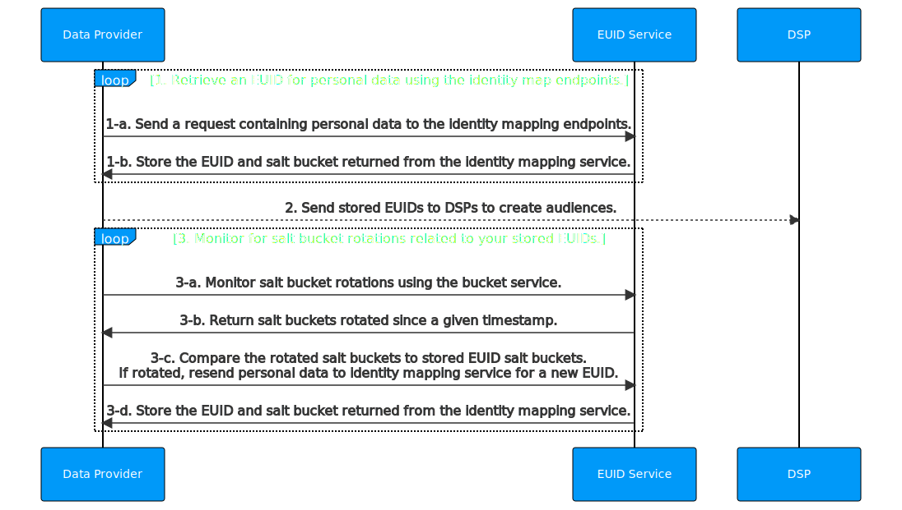

[EUID API Documentation](../../README.md) > [v1](../README.md) > [Integration Guides](README.md) > Advertiser/Data Provider Integration Guide

# Advertiser and Data Provider Integration Guide

This guide covers integration steps for organizations that collect user data and push it to DSPs. Data collectors include advertisers, data on-boarders, measurement providers, identity graph providers, third-party data providers, and other organizations who send data to DSPs. The guide includes the following sections:

* [Integration Steps](#integration-steps)
* [FAQs](#faqs)

## Integration Steps

The following diagram outlines the steps data collectors need to complete to map PII to EUID identifiers for audience-building and targeting. PII refers to a user's normalized email address or SHA256-hashed and normalized email address.

### Retrieve a EUID for PII using the identity map endpoints

| Step | Endpoint | Description |
| --- | --- | --- |
| 1-a | [POST /identity/map](../endpoints/post-identity-map.md) | Send a request containing PII to the identity mapping endpoint. |
| 1-b | [POST /identity/map](../endpoints/post-identity-map.md) | The returned `advertising_id` (EUID) can be used to target audiences on relevant DSPs.  The response returns a user's EUID and the corresponding salt `bucket_id`. The salt assigned to the bucket rotates annually, which impacts the generated EUID. For details on how to check for salt bucket rotation, see [Monitor for salt bucket rotations](#monitor-for-salt-bucket-rotations-related-to-your-stored-euids).  We recommend storing a user's EUID and `bucket_id` in a mapping table for ease of maintenance. For guidance on incremental updates, see [Use an incremental process to continuously update EUIDs](#use-an-incremental-process-to-continuously-update-euids). |

### Send EUID to a DSP to build an audience
Send the `advertising_id` (EUID) from the [preceding step](#retrieve-a-euid-for-pii-using-the-identity-map-endpoints) to a DSP while building your audiences. Each DSP has a unique integration process for building audiences. Please follow the integration guidance provided by the DSP for sending EUIDs to build an audience.

### Monitor for salt bucket rotations related to your stored EUIDs
An EUID is an identifier for a user at a particular moment in time, which means that a user's EUID will rotate at least once a year. 

Even though each salt bucket is updated roughly once a year, individual bucket updates are spread over the year. This means that about 1/365th of all buckets is rotated daily.

>IMPORTANT: To ensure that your integration has the current EUIDs, check salt bucket rotation for active users every day.

| Step | Endpoint | Description |
| --- | --- | --- |
| 3-a | [POST /identity/buckets](../endpoints/post-identity-buckets.md) | Send a request to the bucket status endpoint for all salt buckets changed since a given timestamp. |
| 3-b | [POST /identity/buckets](../endpoints/post-identity-buckets.md) | The bucket status endpoint returns a list of `bucket_id` and `last_updated` timestamps. |
| 3-c | [POST /identity/map](../endpoints/post-identity-map.md) | Compare the returned `bucket_id` to the salt buckets of EUIDs you've cached. If a EUID's salt bucket rotated, resend the PII to the identity mapping service for a new EUID. |
| 3-d | [POST /identity/map](../endpoints/post-identity-map.md) | Store the returned `advertising_id` and `bucket_id`. |

### Use an incremental process to continuously update EUIDs

Continuously update and maintain EUID-based audiences utilizing the preceding steps.

The response from the [EUID retrieval step](#retrieve-a-euid-for-pii-using-the-identity-map-endpoints) contains mapping information. Cache the mapping between PII (`identifier`),  EUID (`advertising_id`), and salt bucket (`bucket_id`), along with a last updated timestamp.

Using the results from the [preceding salt bucket rotation step](#monitor-for-salt-bucket-rotations-related-to-your-stored-euids), remap EUIDs with rotated salt buckets by [retrieving EUIDs using the identity map endpoints](#retrieve-a-euid-for-pii-using-the-identity-map-endpoints). To update the EUIDs in audiences, [send EUID to a DSP](#send-euid-to-a-dsp-to-build-an-audience).

## FAQs
### How do I know when to refresh the EUID due to salt bucket rotation?
Metadata supplied with the EUID generation request indicates the salt bucket used for generating the EUID. Salt buckets persist and correspond to the underlying PII used to generate a EUID. Use the  [POST /identity/buckets](../endpoints/post-identity-buckets.md) endpoint to return which salt buckets rotated since a given timestamp. The returned rotated salt buckets inform you which EUIDs to refresh.

### Do refreshed emails get assigned to the same bucket with which they were previously associated?
Not necessarily. After you remap emails associated with a particular bucket ID, the emails might be assigned to a different bucket ID. To check the bucket ID, [call the mapping function](#retrieve-a-euid-for-pii-using-the-identity-map-endpoints) and save the returned EUID and bucket ID again.

>IMPORTANT: When mapping and remapping emails, be sure not to make any assumptions of the number of buckets, their specific rotation dates, or to which bucket an email gets assigned. 

### How often should UIDs be refreshed for incremental updates?
The recommended cadence for updating audiences is daily.

Even though each salt bucket is updated roughly once a year, individual bucket updates are spread over the year. This means that about 1/365th of all buckets is rotated daily. If fidelity is critical, consider calling the [POST /identity/buckets](../endpoints/post-identity-buckets.md) endpoint more frequently, for example, hourly.

### How should I generate the SHA256 of PII for mapping?
The system should follow the [email normalization rules](../../README.md#email-address-normalization) and hash without salting.

### Should I store large volumes of email address or email address hash mappings? 
Yes. Not storing email address or hash mappings may increase processing time drastically when you have to map millions of addresses. Recalculating only those mappings that actually need to be updated, however, reduces the total processing time because only about 1/365th of EUIDs need to be updated daily.

>IMPORTANT: Unless you are using a private operator, you must map email addresses or hashes consecutively, using a single HTTP connection, in batches of 5-10K emails at a time. In other words, do your mapping without creating multiple parallel connections. 

### How should I handle user optouts?
When a user opts out of EUID-based targeted advertising through the [Transparency and Control Portal](https://www.transparentadvertising.eu/), the optout signal is sent to DSPs and publishers, which handle optouts at bid time. As an advertiser or data provider, you do not need to check for EUID optout in this scenario.

If a user opts out through your website, you should follow your internal procedures for handling the optout, for example, you might choose not to generate a EUID for that user.
