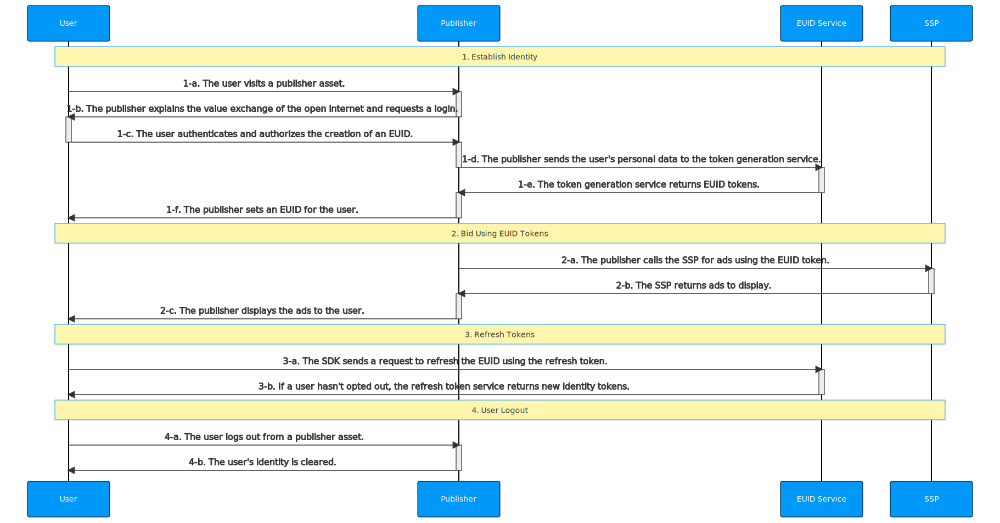

[EUID API Documentation](../../README.md) > [v1](../README.md) > [Integration Guides](README.md) > Publisher EUID SDK Integration Guide

# Publisher EUID SDK Integration Guide

This guide is intended for publishers with web assets who would like to generate identity tokens utilizing EUID for the RTB bid stream, while integrating directly with EUID rather than EUID-enabled single-sign-on or identity providers. 

The guide outlines the [basic steps](#integration-steps) that you need to consider for your integration. For example, you need to decide how to implement user login and logout, how to manage EUID identity information and use it for targeted advertising, how to refresh tokens, deal with missing identities, and handle user opt-outs. See also [FAQs](#faqs).

To facilitate the process of establishing client identity using EUID and retrieving advertising tokens, the web integration steps provided in this guide rely on the [Client-Side Identity JavaScript SDK](../sdks/client-side-identity.md), also known as the EUID SDK.

>IMPORTANT: The EUID SDK currently stores tokens in first-party cookies. Since implementation details like this may change in the future, to avoid potential issues, be sure to rely on the [EUID SDK APIs](../sdks/client-side-identity.md#api-reference) for your identity management.

For custom integration scenarios for app developers and CTV broadcasters without utilizing the EUID SDK, see [Publisher EUID SDK Integration Guide](./custom-publisher-integration.md). 


## Integration Steps 

The following diagram outlines the steps required for a user to establish a EUID token with a publisher and how the EUID token integrates with the RTB bid stream.



The following sections provide additional details for each step in the diagram:
 
 1. [Establish identity: user login](#establish-identity-user-login)
 2. [Bid using EUID tokens](#bid-using-euid-tokens)
 3. [Refresh tokens](#refresh-tokens)
 4. [Clear Identity: user logout](#clear-identity-user-logout)

### Establish Identity: User Login


After authentication in step 1-c, which forces the user to accept the rules of engagement and allows the publisher to validate their email address or phone number, a EUID token must be generated on the server side. The following table details the token generation steps.

| Step | Endpoint/SDK | Description |
| :--- | :--- | :--- |
| 1-d | [POST /token/generate](../endpoints/post-token-generate.md) | After the user authenticates and authorizes the creation of a EUID, use the [POST /token/generate](../endpoints/post-token-generate.md) endpoint to generate a EUID token using the provided normalized email address or phone number of the user. |
| 1-e | [POST /token/generate](../endpoints/post-token-generate.md) | Return a EUID token generated from the user's email address, phone number, or the respective hash. |
| 1-f | [EUID SDK](../sdks/client-side-identity.md) | Send the returned EUID token from step 1-e to the SDK in the `identity` property of its [init() function](../sdks/client-side-identity.md#initopts-object-void) and specify a [callback function](../sdks/client-side-identity.md#callback-function) as shown below. The mechanism ensures that EUID tokens are available for the user for targeting advertising until they log out. |


```html
<script>
 __euid.init({
   callback : function (state) {...}, // Check advertising token and its status within the passed state and initiate targeted advertising. 
   identity : {...} // The `body` property value from the token/generate API response.
 });
</script>
```

For example:

```html
<script>
 __euid.init({
   callback : onEuidIdentityUpdated,
   identity : {
        "advertising_token": "AgmZ4dZgeuXXl6DhoXqbRXQbHlHhA96leN94U1uavZVspwKXlfWETZ3b/besPFFvJxNLLySg4QEYHUAiyUrNncgnm7ppu0mi6wU2CW6hssiuEkKfstbo9XWgRUbWNTM+ewMzXXM8G9j8Q=",
        "refresh_token": "Mr2F8AAAF2cskumF8AAAF2cskumF8AAAADXwFq/90PYmajV0IPrvo51Biqh7/M+JOuhfBY8KGUn//GsmZr9nf+jIWMUO4diOA92kCTF69JdP71Ooo+yF3V5yy70UDP6punSEGmhf5XSKFzjQssCtlHnKrJwqFGKpJkYA==",
        "identity_expires": 1633643601000,
        "refresh_from": 1633643001000,
        "refresh_expires": 1636322000000
    }
 });
</script>
```

The SDK invokes the specified [callback function](../sdks/client-side-identity.md#callback-function) (which indicates the identity availability) and makes the established identity available client-side for bidding. 

### Bid Using EUID Tokens

Based on the status and availability of a valid identity, the SDK sets up the background token auto-refresh, stores identity information in a [first-party cookie](../sdks/client-side-identity.md#euid-cookie-format), and uses it to initiate requests for targeted advertising.

| Step | Endpoint/SDK | Description |
| :--- | :--- | :--- |
| 2-a | [EUID SDK](../sdks/client-side-identity.md) | Get the current user's advertising token by using the [getAdvertisingToken() function](../sdks/client-side-identity.md#getadvertisingtoken-string) as shown below. |


```html
<script>
  let advertisingToken = __euid.getAdvertisingToken();
</script>
```

>TIP: You need to consider how you pass the returned advertising token to SSPs.

### Refresh Tokens

As part of its initialization, the SDK sets up a [token auto-refresh](../sdks/client-side-identity.md#background-token-auto-refresh) for the identity, which is triggered in the background by the timestamps on the identity or failed refresh attempts due intermittent errors.

| Step | Endpoint/SDK | Description |
| :--- | :--- | :--- |
| 3-a | [EUID SDK](../sdks/client-side-identity.md) | The SDK automatically refreshes EUID tokens in the background. No manual action is required. |
| 3-b | [EUID SDK](../sdks/client-side-identity.md) | If the user hasn't opted out, the [POST /token/refresh](../endpoints/post-token-refresh.md) automatically returns new identity tokens. |


### Clear Identity: User Logout

The client lifecycle is complete when the user decides to log out from the publisher's site (not EUID). This closes the client's identity session and clears the first-party cookie information.

| Step | Endpoint/SDK | Description |
| :--- | :--- | :--- |
| 4-a | N/A | The user logs out from the publisher's asset. |
| 4-b | [EUID SDK](../sdks/client-side-identity1.md) | Clear the EUID identity from the first-party cookie and disconnect the client lifecycle by using the [disconnect() function](../sdks/client-side-identity.md#disconnect-void) as shown below.|


```html
<script>
  __euid.disconnect();
</script>
```

## FAQs

### How will I be notified of user opt-out?

The [EUID SDK](../sdks/client-side-identity.md) background token auto-refresh process handles user opt-outs. If user opts out, when the EUID SDK attempts token refresh, it will learn about the optout and will clear the session (including the cookie) and invoke the callback with the `OPTOUT` status.

### Where should I make token generation calls, from the server or client side?

EUID tokens must be generated only on the server side after authentication. In other words, to ensure that the API key used to access the service remains secret, the [POST /token/generate](../endpoints/post-token-generate.md) endpoint must be called only from the server side.

### Can I make token refresh calls from the client side?

Yes. The [POST /token/refresh](../endpoints/post-token-refresh.md) can be called from the client side (for example, a browser or a mobile app) because it does not require using an API key.

### How can I test that the PII sent and returned tokens match?

You can use the [POST /token/validate](../endpoints/post-token-validate.md) endpoint to check whether the PII you are sending through [POST /token/generate](../endpoints/post-token-generate.md) is valid. 

1. Send a [POST /token/generate](../endpoints/post-token-generate.md) request using one of the following values:
    - The `validate@email.com` as the `email` value.
    - The hash of `validate@email.com` as the `email_hash` value. 
2. Store the returned `advertising_token` for use in the following step.
3. Send a [POST /token/validate](../endpoints/post-token-validate.md) request using the `email` or `email_hash` value that you sent in step 1 and the `advertising_token` (saved in step 2) as the `token` property value. 
    - If the response returns `true`, it indicates that the PII you sent as a request in step 1 matches the token you received in the response of step 1. 
    - If it returns `false`, it indicates that there may be an issue with the way you are sending email addresses or email address hashes.

### How can I test the refresh token logout workflow?

You can use the `optout@email.com` email address to test your token refresh workflow. Using this email addrees in a request always generates an identity response with a `refresh_token` that results in a logout response.

1. Send a [POST /token/generate](../endpoints/post-token-generate.md) request using one of the following values:
    - The `optout@email.com` as the `email` value.
    - The hash of `optout@email.com` as the `email_hash` value. 
2. Wait until the SDK's [background auto-refresh](../sdks/client-side-identity.md#background-token-auto-refresh) attempts to refresh the advertising token (this can take several hours) and observe the refresh attempt fail with the `OPTOUT` status. At this point the SDK also clears the first-party cookie.
