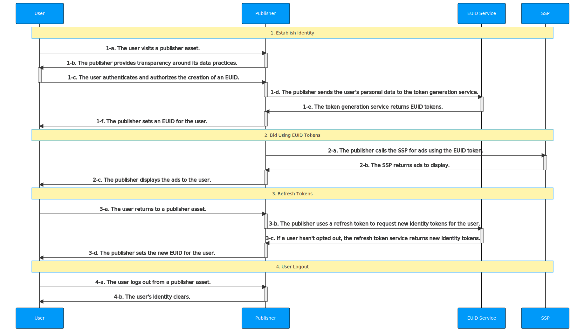

[EUID API Documentation](../../README.md) > [v2](../README.md) > [Integration Guides](README.md) > Publisher Integration Guide, Server-Only (Without SDK)

# Publisher Integration Guide, Server-Only (Without SDK)

This guide is intended for app developers and CTV broadcasters who would like to generate identity tokens utilizing EUID for the RTB bid stream, while integrating directly with EUID rather than EUID-enabled single-sign-on or identity providers. 

The guide outlines the [basic steps](#integration-steps) that you need to consider if you're building an integration without using an SDK. For example, you need to decide how to implement user login and logout, how to manage EUID identity information and use it for targeted advertising, how to refresh tokens, deal with missing identities, and handle user opt-outs. See also [FAQs](#faqs).

>TIP: To facilitate the process of establishing client identity using EUID and retrieving advertising tokens, consider using the [Client-Side JavaScript SDK](../sdks/client-side-identity.md). For details, see [Client-Side JavaScript SDK Integration Guide](publisher-client-side.md).

## Integration Steps

The following diagram outlines the steps required for a user to establish a EUID token with a publisher and how the EUID token integrates with the RTB bid stream.
 

The following sections provide additional details for each step in the diagram:
 
 1. [Establish identity: user login](#establish-identity-user-login)
 2. [Bid using EUID tokens](#bid-using-euid-tokens)
 3. [Refresh tokens](#refresh-tokens)
 4. [Clear Identity: user logout](#clear-identity-user-logout)

### Establish Identity: User Login

After authentication in step 1-c, which forces the user to accept the rules of engagement and allows the publisher to validate their email address or phone number, a EUID token must be generated on the server side. The following table details the token generation steps.

| Step | Endpoint | Description |
| :--- | :--- | :--- |
| 1-d | [POST /token/generate](../endpoints/post-token-generate.md) | There are two ways for publishers to establish identity with EUID: - Integrate with a EUID-enabled single-sign-on provider. - Use the [POST /token/generate](../endpoints/post-token-generate.md) endpoint to generate a EUID token using the provided normalized email address or phone number of the user. |
| 1-e | [POST /token/generate](../endpoints/post-token-generate.md) | Return a EUID token generated from the user's email address, phone number, or the respective hash. |
| 1-f | N/A | Place the returned `advertising_token` and `refresh_token` in a store tied to a user. You may consider client-side storage like a first-party cookie or server-side storage. |

### Bid Using EUID Tokens

You need to consider how you want to manage EUID identity information and use it for targeted advertising&#8212;for example, to pass the returned advertising token to SSPs.

| Step | Endpoint | Description |
| :--- | :--- | :--- |
| 2-a | N/A| Send the `advertising_token` from step [1-e](#establish-identity) to the SSP for bidding. Send the value as is. |

### Refresh Tokens

Leverage the refresh endpoint to retrieve the latest version of EUID tokens. The EUID token must be refreshed to sync the user's EUID rotation and opt-out status. If the user opts out, using their refresh token will end their token refresh chain.

| Step | Endpoint | Description |
| :--- | :--- | :--- |
| 3-a |N/A | When a user returns to an asset and becomes active again, refresh the identity token before sending it to the SSP. | 
| 3-b | [POST /token/refresh](../endpoints/post-token-refresh.md)  | Send the `refresh_token` obtained in step [1-e](#establish-identity) as a query parameter. |
| 3-c | [POST /token/refresh](../endpoints/post-token-refresh.md) | The EUID service issues a new identity token for users that haven't opted out. |
| 3-d | N/A| Place the returned `advertising_token` and `refresh_token` in a store tied to a user. You may consider client-side storage like a first-party cookie or server-side storage. |

>TIP: Refresh tokens starting from the `refresh_from` timestamp on the identity returned by the [POST /token/generate](../endpoints/post-token-generate.md) or [POST /token/refresh](../endpoints/post-token-refresh.md) calls. 

### Clear Identity: User Logout

| Step | Endpoint | Description |
| :--- | :--- | :--- |
| 4-a | N/A | The user logs out from a publisher asset. |
| 4-b | N/A | Remove the EUID tokens you have stored for that user. No interaction with the EUID service is required. |

## FAQs

### Do I need to decrypt tokens?
No, publishers do not need to decrypt tokens.

### How will I be notified of user opt-out?
The token refresh process handles user opt-outs. The [POST /token/refresh](../endpoints/post-token-refresh.md) returns empty identity and the optout status for the user. To resume using EUID-based targeted advertising, the user needs to log in again to re-establish the EUID identity.

### Where should I make token generation calls, from the server or client side?

EUID tokens must be generated only on the server side after authentication. In other words, to ensure that the API key used to access the service remains secret, the [POST /token/generate](../endpoints/post-token-generate.md) endpoint must be called only from the server side.

### Can I make token refresh calls from the client side?

Yes. The [POST /token/refresh](../endpoints/post-token-refresh.md) can be called from the client side (for example, a browser or a mobile app) because it does not require using an API key.

### What is the uniqueness and rotation policy for EUID token?

The EUID service encrypts tokens using random initialization vectors. The encrypted EUID is unique for a given user as they browse the internet. At every refresh, the token re-encrypts. This mechanism ensures that untrusted parties cannot track a user's identity.

### How can I test that the personal data sent and returned tokens match?

You can use the [POST /token/validate](../endpoints/post-token-validate.md) endpoint to check whether the personal data you are sending through [POST /token/generate](../endpoints/post-token-generate.md) is valid. 

1. Send a [POST /token/generate](../endpoints/post-token-generate.md) request using one of the following values:
    - The `validate@email.com` as the `email` value.
    - The hash of `validate@email.com` as the `email_hash` value. 
2. Store the returned `advertising_token` for use in the following step.
3. Send a [POST /token/validate](../endpoints/post-token-validate.md) request using the `email` or `email_hash` value that you sent in step 1 and the `advertising_token` (saved in step 2) as the `token` property value. 
    - If the response returns `true`, the personal data that you sent as a request in step 1 match the token you received in the response of step 1. 
    - If it returns `false`, there may be an issue with the way you are sending email addresses or email address hashes.

### How can I test the refresh token logout workflow?

You can use the `optout@email.com` email address to test your token refresh workflow. Using this email address in a request always generates an identity response with a `refresh_token` that results in a logout response.

1. Send a [POST /token/generate](../endpoints/post-token-generate.md) request using one of the following values:
    - The `optout@email.com` as the `email` value.
    - The hash of `optout@email.com` as the `email_hash` value. 
2. Store the returned `refresh_token` for use in the following step.
3. Send a [POST /token/refresh](../endpoints/post-token-refresh.md) request with the `refresh_token` (saved in step 2) as the `token` value. The body response should be empty, and the `status` value should be set to `optout` because the `optout@email.com` email always results in a logged out user.

### Should /token/generate return the “optout” status and generate no tokens if I pass optout@email.com in the request payload? 

The [POST /token/generate](../endpoints/post-token-generate.md) endpoint does not check for opt-out records and returns the `success` status with valid advertising and user tokens in response to valid requests.

>IMPORTANT: Be sure to call this endpoint only when you have obtained legal basis to convert the user's personal information to EUID tokens. [POST /token/generate](../endpoints/post-token-generate.md) calls automatically opt in users associated with the provided personal information to EUID-based targeted advertising. 

To check for opt-out requests, use the [POST /token/refresh](../endpoints/post-token-refresh.md) endpoint.
