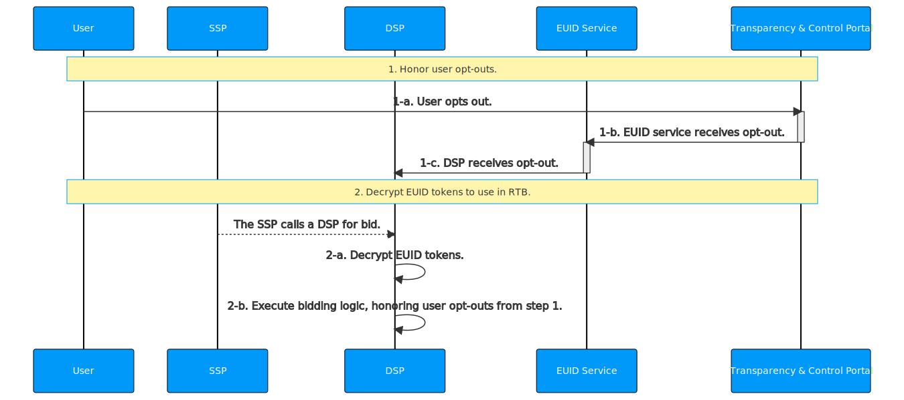

[EUID Overview](../../../README.md) > [Getting Started: Summary](../getting-started/gs-summary.md) > [EUID API Documentation](../summary-doc-v2.md) > [EUID Integration Guides: Summary](summary-guides.md) > DSP Integration Guide

# DSP Integration Guide

This guide is for DSPs who transact on EUIDs in the bid stream.

It includes the following sections:

* [Integration Steps](#integration-steps)
   - [Honor User Opt-Outs](#honor-user-opt-outs)
   - [Decrypt EUID Tokens for RTB Use](#decrypt-euid-tokens-for-rtb-use)
* [FAQs](#faqs)

## Integration Steps 

The following describes the integration workflow for DSP to support EUID as part of RTB, which consists of two major steps:
1. [Honor user opt-outs](#honor-user-opt-outs)
2. [Decrypt EUID tokens to use in RTB](#decrypt-euid-tokens-for-rtb-use)



### Honor User Opt-Outs

To receive and honor user opt-outs from the EUID service, DSPs establish a pre-configured interface and provides it to the EUID service during onboarding. The EUID service sends the user's EUID and an opt-out timestamp to the pre-determined interface. Examples of interfaces include webhooks and API endpoints.

The EUID service sends the following data within seconds of a user's opt-out, which the DSP records and uses the bidding logic defined in [Decrypt EUID Tokens for RTB Use](#decrypt-euid-tokens-for-rtb-use).

| Parameter | Description |
| :--- | :--- |
| `identity` | The EUID for the user who opted out. |
| `timestamp` | The time when the user opted out. |


The following example  illustrates a webhook configured to receive the EUID and a corresponding timestamp:

```html
https://dsp.example.com/optout?user=%%identity%%&optouttime=%%timestamp%%
```
#### Bidding Opt-Out Logic

Use the logic below during bidding (2-b) to honor a user's opt-out.

Leverage one of the server-side SDKs (see [SDKs](../sdks/summary-sdks.md)) to decrypt incoming EUID tokens into raw EUIDs. The response to the decrypt function contains the raw EUID.

The following diagram illustrates opt-out logic.


If the `established_timestamp` value is less than the `optout_timestamp` value, the user opted out and the EUID should not be used for RTB. In these cases, it is up to the DSP whether they want to send an alternate ID for bidding or not bid.

The logic for the <b>check opt-out</b> step is the following:

```java
if (established_timestamp < optout_timestamp) {
  // Opted out
}
```

### Decrypt EUID Tokens for RTB Use

| Step | SDK | Description |
| :--- | :--- | :--- |
| 2-a | Server-side SDK (see [SDKs](../sdks/summary-sdks.md)) | Leverage the provided SDK to decrypt incoming EUID tokens. The response contains the `EUID` and the EUID creation time. |
| 2-b | | DSPs are required to honor opt-out protocol for EUIDs. For details on configuring user opt-outs and honoring them during bidding, see [Honor user opt-outs](#honor-user-opt-outs). |

## FAQs

For a list of frequently asked questions for DSPs, see [FAQs for DSPs](../getting-started/gs-faqs.md#faqs-for-dsps).
