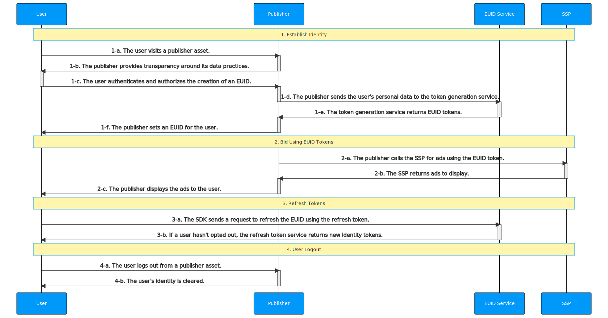

[EUID Overview](../../../README.md) > [Getting Started](../../getting-started.md) > [v2](../summary-doc-v2.md) > [Integration Guides](summary-guides.md) > Client-Side JavaScript SDK Integration Guide

# Client-Side JavaScript SDK Integration Guide

This guide is for publishers with web assets who would like to generate identity tokens utilizing EUID for the RTB bid stream, while integrating directly with EUID rather than EUID-enabled single-sign-on or identity providers. 

It includes the following sections:

- [Introduction](#introduction)
- [Integration Steps ](#integration-steps)
  - [Establish Identity: User Login](#establish-identity-user-login)
  - [Bid Using EUID Tokens](#bid-using-euid-tokens)
  - [Refresh Tokens](#refresh-tokens)
  - [Clear Identity: User Logout](#clear-identity-user-logout)
- [FAQs](#faqs)

## Introduction

This guide outlines the [basic steps](#integration-steps) that you need to consider for your integration. For example, you need to decide how to implement user login and logout, how to manage EUID identity information and use it for targeted advertising, how to refresh tokens, deal with missing identities, and handle user opt-outs. See also [FAQs](#faqs).

To facilitate the process of establishing client identity using EUID and retrieving advertising tokens, the web integration steps provided in this guide rely on the [Client-Side JavaScript SDK](../sdks/client-side-identity.md).

>IMPORTANT: The SDK currently stores tokens in first-party cookies. Since implementation details like this may change in the future, to avoid potential issues, be sure to rely on the [EClient-Side JavaScript SDK APIs](../sdks/client-side-identity.md#api-reference) for your identity management.

For integration scenarios for publishers that do not use the [Client-Side JavaScript SDK](../sdks/client-side-identity.md), see [Publisher Integration Guide, Server-Only (Without SDK)](custom-publisher-integration.md). 

## Integration Steps 

The following diagram outlines the steps required for a user to establish a EUID token with a publisher and how the EUID token integrates with the RTB bid stream.



The following sections provide additional details for each step in the diagram:
 
 1. [Establish identity: user login](#establish-identity-user-login)
 2. [Bid using EUID tokens](#bid-using-euid-tokens)
 3. [Refresh tokens](#refresh-tokens)
 4. [Clear Identity: user logout](#clear-identity-user-logout)

### Establish Identity: User Login

After authentication in step 1-c, which forces the user to accept the rules of engagement and allows the publisher to validate their email address or phone number, a EUID token must be generated on the server side. The following table details the token generation steps.

| Step | Endpoint/SDK | Description |
| :--- | :--- | :--- |
| 1-d | [POST /token/generate](../endpoints/post-token-generate.md) | After the user authenticates and authorizes the creation of a EUID, use the [POST /token/generate](../endpoints/post-token-generate.md) endpoint to generate a EUID token using the provided normalized email address or phone number of the user. |
| 1-e | [POST /token/generate](../endpoints/post-token-generate.md) | Return a EUID token generated from the user's email address, phone number, or the respective hash. |
| 1-f | [Client-Side JavaScript SDK](../sdks/client-side-identity.md) | Send the returned EUID token from step 1-e to the SDK in the `identity` property of its [init() function](../sdks/client-side-identity.md#initopts-object-void) and specify a [callback function](../sdks/client-side-identity.md#callback-function) as shown below. The mechanism ensures that EUID tokens are available for the user for targeting advertising until they log out. |


```html
<script>
 __euid.init({
   callback : function (state) {...}, // Check advertising token and its status within the passed state and initiate targeted advertising. 
   identity : {...} // The `body` property value from the token/generate API response.
 });
</script>
```

For example:

```html
<script>
 __euid.init({
   callback : onEuidIdentityUpdated,
   identity : {
        "advertising_token": "AgmZ4dZgeuXXl6DhoXqbRXQbHlHhA96leN94U1uavZVspwKXlfWETZ3b/besPFFvJxNLLySg4QEYHUAiyUrNncgnm7ppu0mi6wU2CW6hssiuEkKfstbo9XWgRUbWNTM+ewMzXXM8G9j8Q=",
        "refresh_token": "Mr2F8AAAF2cskumF8AAAF2cskumF8AAAADXwFq/90PYmajV0IPrvo51Biqh7/M+JOuhfBY8KGUn//GsmZr9nf+jIWMUO4diOA92kCTF69JdP71Ooo+yF3V5yy70UDP6punSEGmhf5XSKFzjQssCtlHnKrJwqFGKpJkYA==",
        "identity_expires": 1633643601000,
        "refresh_from": 1633643001000,
        "refresh_expires": 1636322000000
    }
 });
</script>
```

The SDK invokes the specified [callback function](../sdks/client-side-identity.md#callback-function) (which indicates the identity availability) and makes the established identity available client-side for bidding. 

### Bid Using EUID Tokens

Based on the status and availability of a valid identity, the SDK sets up the background token auto-refresh, stores identity information in a [first-party cookie](../sdks/client-side-identity.md#euid-cookie-format), and uses it to initiate requests for targeted advertising.

| Step | Endpoint/SDK | Description |
| :--- | :--- | :--- |
| 2-a | [Client-Side JavaScript SDK](../sdks/client-side-identity.md) | Get the current user's advertising token by using the [getAdvertisingToken() function](../sdks/client-side-identity.md#getadvertisingtoken-string) as shown below. |


```html
<script>
  let advertisingToken = __euid.getAdvertisingToken();
</script>
```

>TIP: You need to consider how you pass the returned advertising token to SSPs.

### Refresh Tokens

As part of its initialization, the SDK sets up a [token auto-refresh](../sdks/client-side-identity.md#background-token-auto-refresh) for the identity, which is triggered in the background by the timestamps on the identity or failed refresh attempts due intermittent errors.

| Step | Endpoint/SDK | Description |
| :--- | :--- | :--- |
| 3-a | [Client-Side JavaScript SDK](../sdks/client-side-identity.md) | The SDK automatically refreshes EUID tokens in the background. No manual action is required. |
| 3-b | [Client-Side JavaScript SDK](../sdks/client-side-identity.md) | If the user hasn't opted out, the [POST /token/refresh](../endpoints/post-token-refresh.md) automatically returns new identity tokens. |


### Clear Identity: User Logout

The client lifecycle is complete when the user decides to log out from the publisher's site (not EUID). This closes the client's identity session and clears the first-party cookie information.

| Step | Endpoint/SDK | Description |
| :--- | :--- | :--- |
| 4-a | N/A | The user logs out from the publisher's asset. |
| 4-b | [Client-Side JavaScript SDK](../sdks/client-side-identity.md) | Clear the EUID identity from the first-party cookie and disconnect the client lifecycle by using the [disconnect() function](../sdks/client-side-identity.md#disconnect-void) as shown below.|

```html
<script>
  __euid.disconnect();
</script>
```

## FAQs

For a list of frequently asked questions for the publisher audience, see [FAQs for Publishers Using an SDK](../getting-started/gs-faqs.md#faqs-for-publishers-using-an-sdk).

For a full list, see [Frequently Asked Questions](../getting-started/gs-faqs.md).