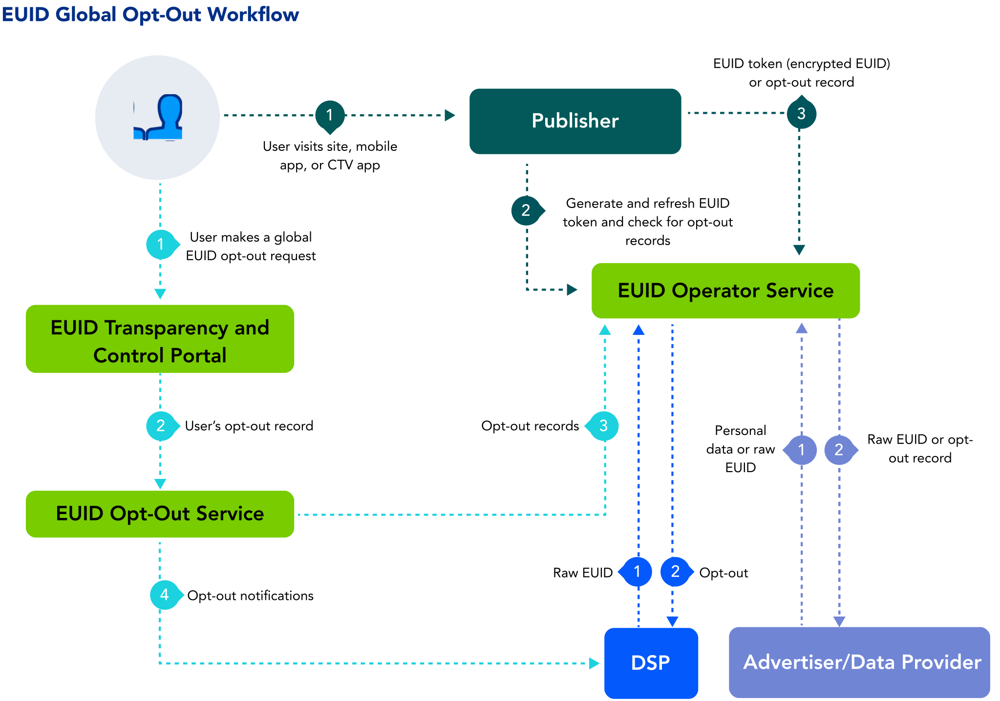

import Link from '@docusaurus/Link';

# User Opt-Out

Many different publishers and advertisers use EUID. Different publishers might have different opt-out processes for their individual sites; however, EUID as a whole has very specific opt-out processes that all EUID [participants](../overviews/participants-overview.md#euid-external-participants) are expected to honor.

## How Users Can Opt Out of EUID

Within the EUID ecosystem, there are two types of opt out:
- Opt out of the participant's site
- Opt out of EUID

Because each participant has their own opt-out workflow, participants are mandated to respect a user's opted-out status and therefore not create an EUID for any user who opted out from the participant.

For example, if a user opts out of a publisher's site, but has not opted out of EUID, the publisher should not generate an EUID token for that user.

Consumers can always opt out of EUID being used to show them personalized ads, in the [Transparency and Control Portal](https://www.transparentadvertising.eu/). Choose email address or phone number, enter the data, and follow the prompts.

:::tip
To opt out both your email address and your phone number, do them one at a time.
:::

## Difference Between Opting Out from a Single Participant and Opting Out of EUID

If a consumer opts out from a specific participant, EUID guidelines mandate that the participant no longer uses that consumer's information to create or generate an EUID, because the consumer opted out of that site specifically. Those are the requirements of the EUID framework.

In addition, if a user opts out from a specific participant, that information is not relayed to EUID. Opting out from a specific participant does not opt a consumer out of EUID.

The sure way for a consumer to fully opt out of EUID is in the [Transparency and Control Portal](https://www.transparentadvertising.eu/).

## Opt-Out Workflow

When a consumer opts out of EUID, that individual's EUID is no longer accepted for targeted advertising anywhere in the EUID ecosystem. However, because there is a delay in the time it takes to process and refresh EUID information, the EUID for a user who has opted out might be in play for a short while after opt-out. As each participant periodically refreshes their EUIDs, the opt-out information is propagated to the participants.

The following steps provide a high-level outline of the opt-out workflow intended for users who have had an EUID created from their email address or phone number.

1. Users visit the [Transparency and Control Portal](https://www.transparentadvertising.eu/), where they can globally opt out of EUID.
2. The Transparency and Control Portal sends the opt-out request to the EUID <Link href="../ref-info/glossary-uid#gl-operator-service">Operator Service</Link>.
3. If the user has opted out, the EUID Operator Service distributes the opt-out information to EUID participants, as shown in the following table.

   | Participant | Distribution Method |
   | :--- | :--- | 
   | Publishers | A publisher calling [POST&nbsp;/token/generate](../endpoints/post-token-generate.md) with the required `optout_check` parameter set to `1`, or [POST&nbsp;/token/refresh](../endpoints/post-token-refresh.md), receives the opt-out response instead of the EUID token. |
   | DSPs | The EUID Operator Service distributes information on all opted-out users to DSPs via a webhook provided for the purpose. For details, see [Honor User Opt-Outs](../guides/dsp-guide#honor-user-opt-outs). DSPs can also check the opt-out status of raw EUIDs using the [POST&nbsp;/optout/status](../endpoints/post-optout-status.md) endpoint. |
   | Advertisers and data providers | The EUID Operator Service distributes opt-out information to advertisers and data providers via the [POST&nbsp;/identity/map](../endpoints/post-identity-map.md) endpoint. Another option is to check the opt-out status of raw EUIDs using the [POST&nbsp;/optout/status](../endpoints/post-optout-status.md) endpoint. |

This workflow allows users to opt out of personalized advertising based on their EUID through the Transparency and Control Portal.

