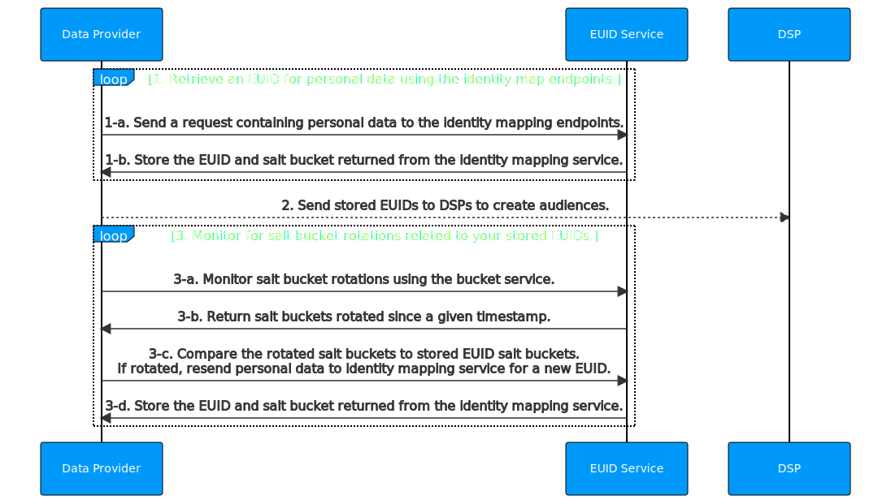

import Link from '@docusaurus/Link';

# Advertiser/Data Provider Integration Guide

This guide covers integration steps for organizations that collect user data and push it to other EUID participants. Data collectors include advertisers, data on-boarders, measurement providers, identity graph providers, third-party data providers, and any other organizations that send data to other participants.

It includes the following sections:

* [Integration Steps](#integration-steps)
   - [Retrieve a raw EUID for personal data using the identity map endpoints](#retrieve-a-raw-euid-for-personal-data-using-the-identity-map-endpoints)
   - [Send raw EUID to a DSP to build an audience](#send-raw-euid-to-a-dsp-to-build-an-audience)
   - [Monitor for salt bucket rotations related to your stored raw EUIDs](#monitor-for-salt-bucket-rotations-related-to-your-stored-raw-euids)
   - [Use an incremental process to continuously update raw EUIDs](#use-an-incremental-process-to-continuously-update-raw-euids)
* [FAQs](#faqs)

## Integration Steps

The following diagram outlines the steps that data collectors must complete to map personal data to EUID identifiers for audience building and targeting. Personal data refers to a user's normalized email address, or the normalized and SHA-256-hashed email address.

### Retrieve a raw EUID for personal data using the identity map endpoints

| Step | Endpoint | Description |
| --- | --- | --- |
| 1-a | [POST /identity/map](../endpoints/post-identity-map.md) request | Send a request containing personal data to the identity mapping endpoint. |
| 1-b | [POST /identity/map](../endpoints/post-identity-map.md) response | The `advertising_id` (raw EUID) returned in the response can be used to target audiences on relevant DSPs. The response returns a user's raw EUID and the corresponding `bucket_id` for the salt bucket. The salt assigned to the bucket rotates annually, which impacts the generated EUID. For details on how to check for salt bucket rotation, see [Monitor for salt bucket rotations](#monitor-for-salt-bucket-rotations-related-to-your-stored-raw-euids). For ease of maintenance, a recommended approach is to store a user's raw EUID and `bucket_id` in a mapping table. For guidance on incremental updates, see [Use an incremental process to continuously update raw EUIDs](#use-an-incremental-process-to-continuously-update-raw-euids). |

### Send raw EUID to a DSP to build an audience

Send the `advertising_id` (raw EUID) returned in the [preceding step](#retrieve-a-raw-euid-for-personal-data-using-the-identity-map-endpoints) (Step 1-b) to a DSP while building your audiences. Each DSP has a unique integration process for building audiences. Follow the integration guidance provided by the DSP for sending raw EUIDs to build an audience.

### Monitor for salt bucket rotations related to your stored raw EUIDs
A raw EUID is an identifier for a user at a specific moment in time. The raw EUID for a specific user changes at least once per year, as a result of the salt rotation. 

Even though each salt bucket is updated approximately once a year, individual bucket updates are spread over the year. Approximately 1/365th of all salt buckets are rotated daily.

>IMPORTANT: To ensure that your integration has the current raw EUIDs, check salt bucket rotation for active users every day.

| Step | Endpoint | Description |
| --- | --- | --- |
| 3-a | [POST /identity/buckets](../endpoints/post-identity-buckets.md) | Send a request to the bucket status endpoint for all salt buckets that have changed since a specific timestamp. |
| 3-b | [POST /identity/buckets](../endpoints/post-identity-buckets.md) | The bucket status endpoint returns a list of `bucket_id` and `last_updated` timestamps. |
| 3-c | [POST /identity/map](../endpoints/post-identity-map.md) | Compare the returned `bucket_id` to the salt buckets of raw EUIDs that you've cached. If you find that the salt bucket was updated for one or more raw EUIDs, re-send the personal data to the identity mapping service for a new EUID. |
| 3-d | [POST /identity/map](../endpoints/post-identity-map.md) | Store the new values returned for `advertising_id` and `bucket_id`. |

### Use an incremental process to continuously update raw EUIDs

To keep your EUID-based audience information accurate and up to date, follow these integration steps every day.

1. The response from the [EUID retrieval step](#retrieve-a-raw-euid-for-personal-data-using-the-identity-map-endpoints) contains mapping information. Cache the mapping between personal data (`identifier`), raw EUID (`advertising_id`), and salt bucket (`bucket_id`), along with the most recent `last_updated` timestamp.

2. Using the results from the [preceding salt bucket rotation step](#monitor-for-salt-bucket-rotations-related-to-your-stored-raw-euids), remap any raw EUID for which the salt buckets have been rotated by [retrieving raw EUIDs using the identity map endpoints](#retrieve-a-raw-euid-for-personal-data-using-the-identity-map-endpoints). To update the EUIDs in audiences, [send raw EUID to a DSP](#send-raw-euid-to-a-dsp-to-build-an-audience).

## FAQs

For a list of frequently asked questions for advertisers and data providers using the EUID framework, see [FAQs for Advertisers and Data Providers](../getting-started/gs-faqs.md#faqs-for-advertisers-and-data-providers).
