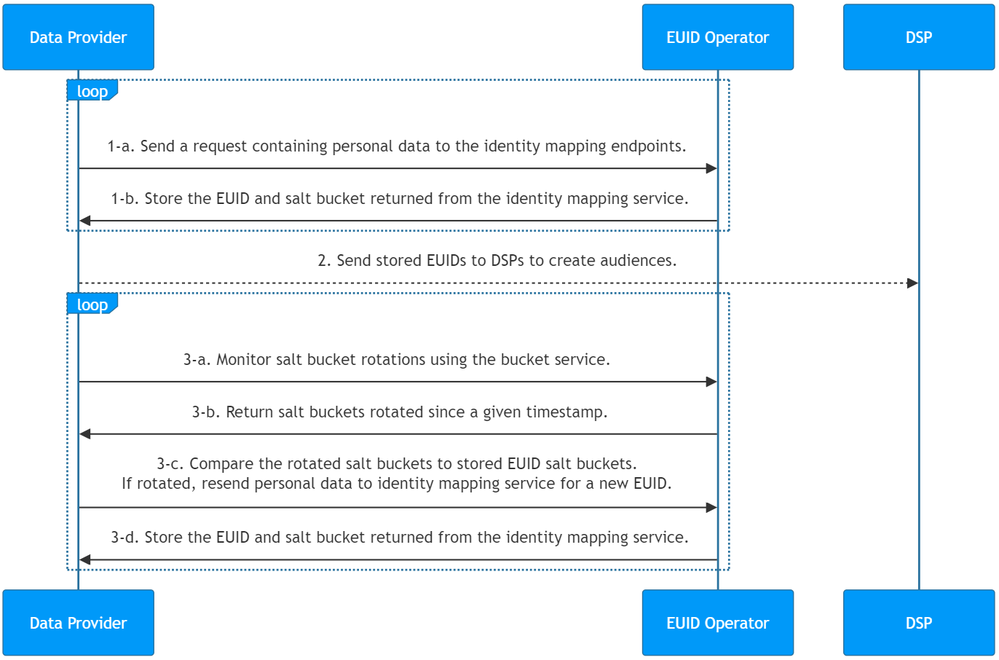

import Link from '@docusaurus/Link';

# Advertiser/Data Provider Integration Guide

This guide covers integration steps for organizations that collect user data and push it to other EUID participants. Data collectors include advertisers, data on-boarders, measurement providers, identity graph providers, third-party data providers, and any other organizations that send data to other participants.

## Integration Steps

The following diagram outlines the steps that data collectors must complete to map <Link href="../ref-info/glossary-uid#gl-personal-data">personal data</Link> to EUID identifiers for audience building and targeting.

Personal data refers to a user's normalized email address, or the normalized and SHA-256-hashed email address.

<!-- diagram source: resource/advertiser-flow-mermaid.md.bak -->

Refer to the following sections for details about the different parts of the diagram:
1. [Retrieve a raw EUID for personal data using the identity map endpoint](#1-retrieve-a-raw-euid-for-personal-data-using-the-identity-map-endpoint)
2. [Send stored raw EUIDs to DSPs to create audiences](#2-send-stored-raw-euids-to-dsps-to-create-audiences)
3. [Monitor for salt bucket rotations related to your stored raw EUIDs](#3-monitor-for-salt-bucket-rotations-related-to-your-stored-raw-euids)

### 1: Retrieve a raw EUID for personal data using the identity map endpoint

| Step | Endpoint | Description |
| --- | --- | --- |
| 1-a | [POST&nbsp;/identity/map](../endpoints/post-identity-map.md) request | Send a request containing personal data to the identity mapping endpoint. |
| 1-b | [POST&nbsp;/identity/map](../endpoints/post-identity-map.md) response | The `advertising_id` (raw EUID) returned in the response can be used to target audiences on relevant DSPs. The response returns a user's raw EUID and the corresponding `bucket_id` for the salt bucket. The salt assigned to the bucket rotates annually, which impacts the generated EUID. For details on how to check for salt bucket rotation, see [3: Monitor for salt bucket rotations](#3-monitor-for-salt-bucket-rotations-related-to-your-stored-raw-euids). For ease of maintenance, a recommended approach is to store a user's raw EUID and `bucket_id` in a mapping table. For guidance on incremental updates, see [Use an incremental process to continuously update raw EUIDs](#use-an-incremental-process-to-continuously-update-raw-euids). |

### 2: Send stored raw EUIDs to DSPs to create audiences

Send the `advertising_id` (raw EUID) returned in Step 1-b to a DSP while building your audiences. Each DSP has a unique integration process for building audiences; follow the integration guidance provided by the DSP for sending raw EUIDs to build an audience.

### 3: Monitor for salt bucket rotations related to your stored raw EUIDs
A raw EUID is an identifier for a user at a specific moment in time. The raw EUID for a specific user changes at least once per year, as a result of the salt rotation. 

Even though each salt bucket is updated approximately once a year, individual bucket updates are spread over the year. Approximately 1/365th of all salt buckets are rotated daily.

:::important
To ensure that your integration has the current raw EUIDs, check salt bucket rotation for active users every day.
:::

| Step | Endpoint | Description |
| --- | --- | --- |
| 3-a | [POST&nbsp;/identity/buckets](../endpoints/post-identity-buckets.md) | Send a request to the bucket status endpoint for all salt buckets that have changed since a specific timestamp. |
| 3-b | [POST&nbsp;/identity/buckets](../endpoints/post-identity-buckets.md) | EUID service: The bucket status endpoint returns a list of `bucket_id` and `last_updated` timestamps. |
| 3-c | [POST&nbsp;/identity/map](../endpoints/post-identity-map.md) | Compare the returned `bucket_id` to the salt buckets of raw EUIDs that you've cached. If you find that the salt bucket was updated for one or more raw EUIDs, re-send the personal data to the identity mapping service for a new raw EUID. |
| 3-d | [POST&nbsp;/identity/map](../endpoints/post-identity-map.md) | Store the new values returned for `advertising_id` and `bucket_id`. |

## Use an Incremental Process to Continuously Update Raw EUIDs

To keep your EUID-based audience information accurate and up to date, follow these integration steps every day.

1. The response from the [EUID retrieval step](#1-retrieve-a-raw-euid-for-personal-data-using-the-identity-map-endpoint) contains mapping information. Cache the following:
   - The mapping between personal data  (`identifier`), raw EUID (`advertising_id`), and salt bucket (`bucket_id`).
   - The most recent `last_updated` timestamp.
2. Using the results from [3: Monitor for salt bucket rotations related to your stored raw EUIDs](#3-monitor-for-salt-bucket-rotations-related-to-your-stored-raw-euids), remap any raw EUID for which the salt buckets have been rotated by retrieving new raw EUIDs for those IDs, following [1: Retrieve a raw EUID for personal data using the identity map endpoint](#1-retrieve-a-raw-euid-for-personal-data-using-the-identity-map-endpoint).

   Then, use the refreshed EUIDs to update audiences, following [2: Send raw EUIDs to a DSP](#2-send-stored-raw-euids-to-dsps-to-create-audiences).

## Check Opt-Out Status

It's important to honor user opt-out status. Here are two ways you can check that you have the latest opt-out information:

- The EUID Operator Service distributes opt-out information to advertisers and data providers via the [POST&nbsp;/identity/map](../endpoints/post-identity-map.md) endpoint.

- Advertisers and data providers can check the opt-out status of raw EUIDs using the [POST&nbsp;/optout/status](../endpoints/post-optout-status.md) endpoint.

## FAQs

For a list of frequently asked questions for advertisers and data providers using the EUID framework, see [FAQs for Advertisers and Data Providers](../getting-started/gs-faqs.md#faqs-for-advertisers-and-data-providers).
