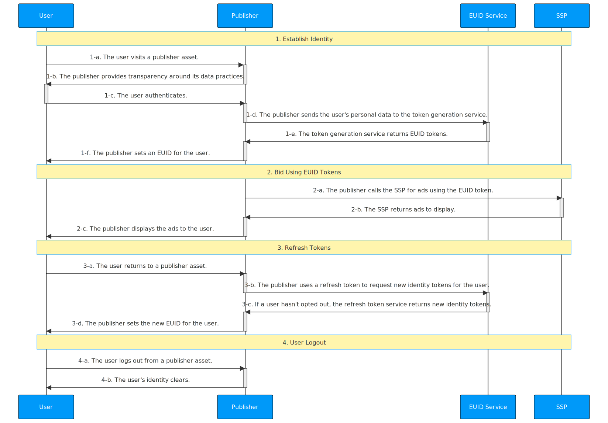

import Link from '@docusaurus/Link';

# Publisher Integration Guide, Server-Only (Without SDK)

This guide is for publishers who want to generate identity tokens using EUID for the RTB bidstream, while integrating directly with EUID rather than EUID-enabled single-sign-on or identity providers. 

It includes the following sections:

- [Introduction](#introduction)
- [Integration Steps ](#integration-steps)
  - [Establish identity: capture user data](#establish-identity-capture-user-data)
  - [Bid Using EUID Tokens](#bid-using-euid-tokens)
  - [Refresh Tokens](#refresh-tokens)
  - [Clear Identity: User Logout](#clear-identity-user-logout)
- [FAQs](#faqs)

## Introduction

The guide outlines the [basic steps](#integration-steps) that you need to consider if you're building an integration without using a client-side or server-side SDK. For example, you need to decide how to do the following:

- Implement opportunities to capture email: for example, promotional exchanges, sign-ups and subscriptions, or marketing form fills.
- Manage EUID identity information and use it for targeted advertising
- Refresh EUID tokens
- Deal with missing identities
- Manage user opt-outs

See also [FAQs](#faqs).

The following are the options available for publishers to integrate with EUID:

- Client JavaScript SDK, with EUID SDK for Java on the server.
- Client JavaScript SDK, with custom server code.
- Server-only integration, with EUID SDK for Java on server.
- Server-only integration, with custom server code.

This document provides details for the last option.

>TIP: To facilitate the process of establishing client identity using EUID and retrieving advertising tokens, consider using the [SDK for JavaScript](../sdks/client-side-identity.md). For details, see [SDK for JavaScript Integration Guide](publisher-client-side.md).

## Integration Steps

The following diagram outlines the steps required for a user to establish an EUID token with a publisher and how the EUID token integrates with the RTB bidstream.
 

The following sections provide additional details for each step in the diagram:
 
 1. [Establish identity: capture user data](#establish-identity-capture-user-data)
 2. [Bid using EUID tokens](#bid-using-euid-tokens)
 3. [Refresh tokens](#refresh-tokens)
 4. [Clear Identity: user logout](#clear-identity-user-logout)

### Establish Identity: Capture User Data

After authentication in step 1-c, which forces the user to accept the rules of engagement and allows the publisher to validate their email address, an EUID token must be generated on the server side. The following table details the token generation steps.

| Step | Endpoint | Description |
| :--- | :--- | :--- |
| 1-d | [POST /token/generate](../endpoints/post-token-generate.md) | There are two ways for publishers to establish identity with EUID: - Integrate with an EUID-enabled single-sign-on provider. - Use the [POST /token/generate](../endpoints/post-token-generate.md) endpoint to generate an EUID token using the provided normalized email address or email address hash of the user. |
| 1-e | [POST /token/generate](../endpoints/post-token-generate.md) | Return an EUID token generated from the user's email address or email address hash. |
| 1-f | N/A | Place the returned `advertising_token` and `refresh_token` in a store tied to a user. You may consider client-side storage like a first-party cookie or server-side storage. |

### Bid Using EUID Tokens

You need to consider how you want to manage EUID identity information and use it for targeted advertising&#8212;for example, to pass the returned advertising token to SSPs.

| Step | Endpoint | Description |
| :--- | :--- | :--- |
| 2-a | N/A| Send the `advertising_token` from step [1-e](#establish-identity-capture-user-data) to the SSP for bidding. Send the value as is. |

### Refresh Tokens

Leverage the refresh endpoint to retrieve the latest version of EUID tokens. The EUID token must be refreshed to sync the user's EUID rotation and opt-out status. If the user opts out, using their refresh token will end their token refresh chain.

| Step | Endpoint | Description |
| :--- | :--- | :--- |
| 3-a |N/A | When a user returns to an asset and becomes active again, refresh the identity token before sending it to the SSP. | 
| 3-b | [POST /token/refresh](../endpoints/post-token-refresh.md)  | Send the `refresh_token` obtained in step [1-e](#establish-identity-capture-user-data) as a query parameter. |
| 3-c | [POST /token/refresh](../endpoints/post-token-refresh.md) | The EUID service issues a new identity token for users that haven't opted out. |
| 3-d | N/A| Place the returned `advertising_token` and `refresh_token` in a store tied to a user. You may consider client-side storage like a first-party cookie or server-side storage. |

>TIP: Refresh tokens starting from the `refresh_from` timestamp on the identity returned by the [POST /token/generate](../endpoints/post-token-generate.md) or [POST /token/refresh](../endpoints/post-token-refresh.md) calls. 

### Clear Identity: User Logout

| Step | Endpoint | Description |
| :--- | :--- | :--- |
| 4-a | N/A | The user logs out from a publisher asset. |
| 4-b | N/A | Remove the EUID tokens you have stored for that user. No interaction with the EUID service is required. |

## FAQs

For a list of frequently asked questions for the publisher audience, see [FAQs for Publishers](../getting-started/gs-faqs.md#faqs-for-publishers).
