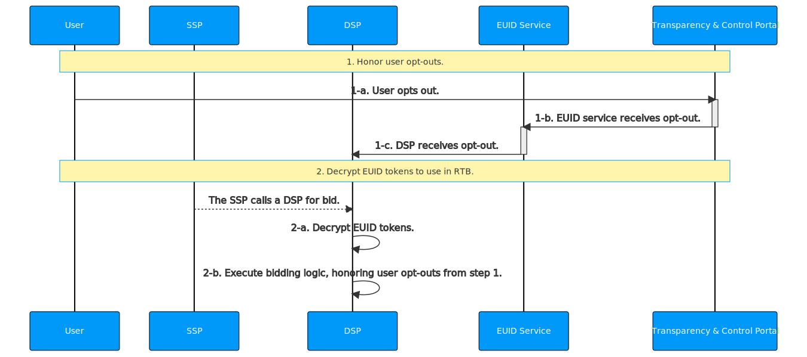

import Link from '@docusaurus/Link';

# DSP Integration Guide

This guide is for DSPs who transact on EUIDs in the <Link href="../ref-info/glossary-uid#gl-bidstream">bidstream</Link>.

DSPs receive EUID tokens in bid requests, and decrypt the EUID tokens to arrive at raw EUIDs that they can use for bidding, using one of the server-side SDKs that support this function.

For a summary of available server-side SDKs, see [SDKs: Summary](../sdks/summary-sdks.md).

:::note
If your back end is written in a language not covered by one of the available server-side SDKs, ask your EUID contact in case there is additional information available to help you. If you're not sure who to ask, see [Contact Info](../getting-started/gs-account-setup.md#contact-info).
:::

## Integration Steps 

The following describes the integration workflow for DSP to support EUID as part of RTB, which consists of two major steps:
1. [Honor user opt-outs](#honor-user-opt-outs)
2. [Decrypt EUID Tokens for RTB Use](#decrypt-euid-tokens-for-rtb-use)



### Honor User Opt-Outs

This section includes the following information for DSPs, who must honor user opt-out of EUID:

- [Opt-Out Webhook](#opt-out-webhook)
- [POST&nbsp;/optout/status Endpoint](#post-optoutstatus-endpoint)
- [Bidding Opt-Out Logic](#bidding-opt-out-logic)

#### Opt-Out Webhook

To receive and honor user opt-outs from the EUID service, the DSP establishes a pre-configured interface (an opt-out webhook/API endpoint) and provides it to the EUID service during onboarding. When a user opts out, the EUID service sends the user's raw EUID and the corresponding opt-out timestamp to the pre-configured interface.

The EUID service sends the following data within seconds of a user's opt-out, which the DSP records and uses the bidding logic defined in [Decrypt EUID Tokens for RTB Use](#decrypt-euid-tokens-for-rtb-use).

| Parameter | Description |
| :--- | :--- |
| `identity` | The EUID for the user who opted out. |
| `timestamp` | The time when the user opted out. |

The DSP must respond to the opt-out data with a 200 response code.

The following example illustrates a webhook configured to receive the raw EUID and the corresponding timestamp:

```html
https://dsp.example.com/optout?user=%%identity%%&optouttime=%%timestamp%%
```

#### POST /optout/status Endpoint

DSPs can check the opt-out status of raw EUIDs using the [POST&nbsp;/optout/status](../endpoints/post-optout-status.md) endpoint.

#### Bidding Opt-Out Logic

Use the logic below during bidding (2-b) to honor a user's opt-out.

Leverage one of the server-side SDKs (see [SDKs: Summary](../sdks/summary-sdks.md)) to decrypt incoming EUID tokens into raw EUIDs. The response to the decrypt function contains the raw EUID.

The following diagram illustrates opt-out logic.


If the user has opted out, the EUID must not be used for RTB. In these cases, the DSP can choose to send an alternate ID for bidding or can choose not to bid.

### Decrypt EUID Tokens for RTB Use

The following table provides details for Step 2 of the workflow diagram shown in [Integration Steps](#integration-steps).

| Step | SDK | Description |
| :--- | :--- | :--- |
| 2-a | Server-side SDK (see [SDKs: Summary](../sdks/summary-sdks.md)) | Leverage the provided SDK to decrypt incoming EUID tokens. The response contains the `EUID` and the EUID creation time. |
| 2-b | | DSPs are required to honor opt-out protocol for EUIDs. For details on configuring user opt-outs and honoring them during bidding, see [Honor user opt-outs](#honor-user-opt-outs). |

## FAQs

For a list of frequently asked questions for DSPs, see [FAQs for DSPs](../getting-started/gs-faqs.md#faqs-for-dsps).
