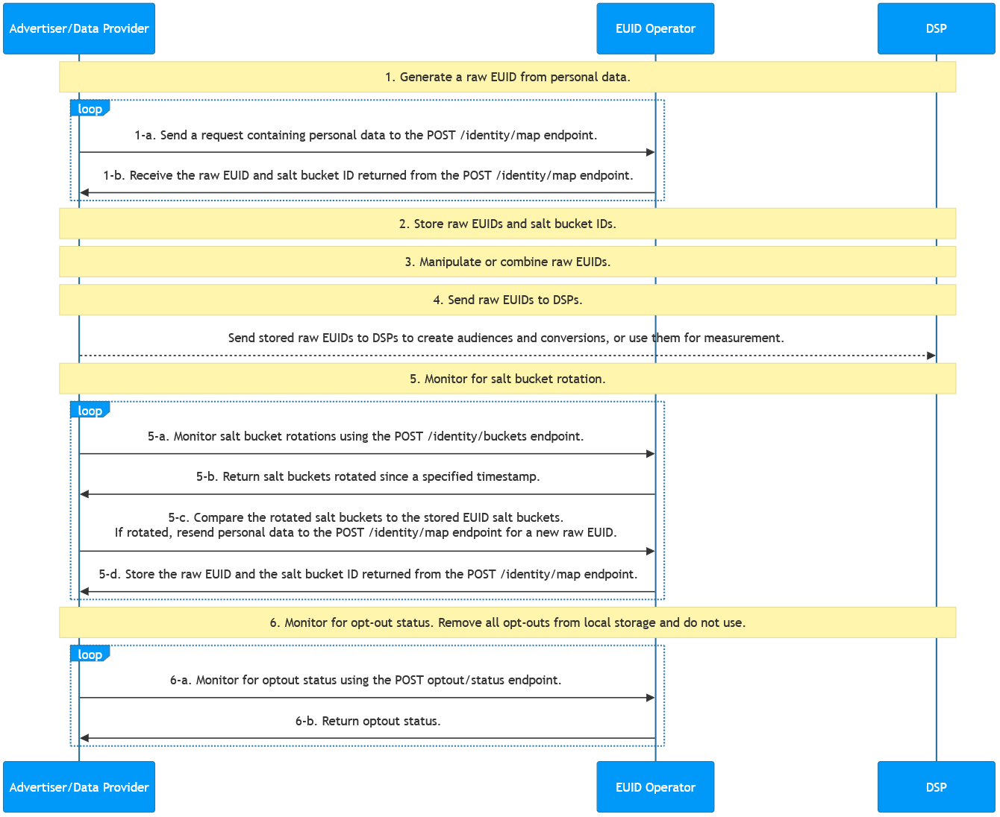

import Link from '@docusaurus/Link';

# Advertiser/Data Provider Integration to HTTP Endpoints

This guide covers integration steps for advertisers and data providers to integrate with EUID by writing code to call EUID HTTP endpoints, rather than using another implementation option such as an SDK or Snowflake.

:::tip
For a summary of all integration options and steps for advertisers and data providers, see [Advertiser/Data Provider Integration Overview](integration-advertiser-dataprovider-overview.md).
:::

## High-Level Steps

At a high level, the steps for advertisers and data providers integrating with EUID are as follows:

1. [Generate Raw EUIDs from Personal Data](#1-generate-raw-euids-from-personal-data)

2. [Store Raw EUIDs and Salt Bucket IDs](#2-store-raw-euids-and-salt-bucket-ids)

3. [Manipulate or Combine Raw EUIDs](#3-manipulate-or-combine-raw-euids)

4. [Send Stored Raw EUIDs to DSPs to Create Audiences or Conversions](#4-send-stored-raw-euids-to-dsps-to-create-audiences-or-conversions)

5. [Monitor for Salt Bucket Rotations for Your Stored Raw EUIDs](#5-monitor-for-salt-bucket-rotations-for-your-stored-raw-euids)

6. [Monitor for Opt-Out Status](#6-monitor-for-opt-out-status)

## Integration Diagram

The following diagram outlines the steps that data collectors must complete to map personal data to raw EUIDs for audience building and targeting.

Personal data refers to a user's normalized email address or phone number, or the normalized and SHA-256-hashed email address or phone number.

<!-- diagram source: resource/advertiser-flow-endpoints-mermaid.md.bak -->

### 1: Generate Raw EUIDs from Personal Data

| Step | Endpoint | Description |
| --- | --- | --- |
| 1-a | [POST&nbsp;/identity/map](../endpoints/post-identity-map.md) request | Send a request containing personal data to the identity mapping endpoint. |
| 1-b | [POST&nbsp;/identity/map](../endpoints/post-identity-map.md) response | The `advertising_id` (raw EUID) returned in the response can be used to target audiences on relevant DSPs. The response returns a user's raw EUID and the corresponding `bucket_id` for the salt bucket. The salt assigned to the bucket rotates annually, which impacts the generated raw EUID. For details on how to check for salt bucket rotation, see [5: Monitor for salt bucket rotations related to your stored raw EUIDs](#5-monitor-for-salt-bucket-rotations-for-your-stored-raw-euids). |

### 2: Store Raw EUIDs and Salt Bucket IDs

The response from Step 1, [Generate Raw EUIDs from Personal Data](#1-generate-raw-euids-from-personal-data), contains mapping information. We recommend that you store the following information returned in Step 1:

- Cache the mapping between personal data (`identifier`), raw EUID (`advertising_id`), and salt bucket (`bucket_id`).
- Store the timestamp for when you received the response data. Later, you can compare this timestamp with the `last_updated` timestamp returned in Step 5, [Monitor for Salt Bucket Rotations for Your Stored Raw EUIDs](#5-monitor-for-salt-bucket-rotations-for-your-stored-raw-euids).

### 3: Manipulate or Combine Raw EUIDs

Use the EUIDs you received in Step 1. For example, you might do one or more of the following:

- Do some manipulation: for example, combine EUIDs you generated from personal data and EUIDs received from another participant such as an advertiser or data provider.
- Add new EUIDs into an existing audience.

### 4: Send Stored Raw EUIDs to DSPs to Create Audiences or Conversions

Use the raw EUIDs for some purpose such as:

   - Sending stored raw EUIDs to DSPs to create audiences and conversions.
   - Using the raw EUIDs for measurement.

For example, you could send the `advertising_id` (<Link href="../ref-info/glossary-uid#gl-raw-euid">raw EUID</Link>) returned in Step 1-b to a DSP while building your audiences. Each DSP has a unique integration process for building audiences; follow the integration guidance provided by the DSP for sending raw EUIDs to build an audience.

You could also send conversion information via API or pixels for measurement (attribution) or for retargeting.

### 5: Monitor for Salt Bucket Rotations for Your Stored Raw EUIDs

A raw EUID is an identifier for a user at a specific moment in time. The raw EUID for a specific user changes at least once per year, as a result of the <Link href="../ref-info/glossary-uid#gl-salt-bucket">salt bucket</Link> rotation. 

Even though each salt bucket is updated approximately once per year, individual bucket updates are spread over the year. Approximately 1/365th of all salt buckets are rotated daily. Based on this, we recommend checking salt bucket rotation regularly, on a cadence that aligns with your audience refreshes. For example, if you refresh weekly, check for salt bucket updates weekly.

If the salt bucket has been rotated, regenerate the raw EUID. For details, see [Determine whether the salt bucket has been rotated](#determine-whether-the-salt-bucket-has-been-rotated).

The following table shows the steps for checking for salt bucket rotation.

| Step | Endpoint | Description |
| --- | --- | --- |
| 5-a | [POST&nbsp;/identity/buckets](../endpoints/post-identity-buckets.md) | Send a request to the `POST /identity/buckets` endpoint for all salt buckets that have changed since a specific timestamp. |
| 5-b | [POST&nbsp;/identity/buckets](../endpoints/post-identity-buckets.md) | EUID service: The `POST /identity/buckets` endpoint returns a list of `bucket_id` and `last_updated` timestamps. |
| 5-c | [POST&nbsp;/identity/map](../endpoints/post-identity-map.md) | Compare the returned `bucket_id` to the salt buckets of raw EUIDs that you've cached. If you find that the salt bucket was updated for one or more raw EUIDs, re-send the personal data to the `POST /identity/map` endpoint for a new raw EUID. |
| 5-d | [POST&nbsp;/identity/map](../endpoints/post-identity-map.md) | Store the new values returned for `advertising_id` and `bucket_id`. |

#### Determine whether the salt bucket has been rotated

To determine whether the salt bucket ID for a specific raw EUID has changed, follow these steps.

1. Compare these two values:

   - The `last_updated` timestamp of each `bucket_id` returned as part of monitoring the salt bucket rotations.
   
   - The timestamp of the raw EUID generation of the same `bucket_id`, which was returned in Step 1 and stored in Step 2.

1. If the `last_updated` timestamp is more recent than the timestamp you recorded earlier, the salt bucket has been rotated. As a result, you'll need to regenerate any raw EUIDs associated with this `bucket_id`, following Step 1, [Generate Raw EUIDs from Personal Data](#1-generate-raw-euids-from-personal-data).

### 6: Monitor for Opt-Out Status

It's important to honor user opt-out status. Periodically, monitor for opt-out status, to be sure that you don't continue using EUIDs for users that have recently opted out.

There are two ways that you can check with the EUID <Link href="../ref-info/glossary-uid#gl-operator-service">Operator Service</Link> to make sure you have the latest opt-out information:

- Call the [POST&nbsp;/identity/map](../endpoints/post-identity-map.md) endpoint to check for opt-outs. If the personal data has been opted out, no raw EUID is generated.

- Check the opt-out status of raw EUIDs using the [POST&nbsp;/optout/status](../endpoints/post-optout-status.md) endpoint.

For details about the EUID opt-out workflow and how users can opt out, see [User Opt-Out](../getting-started/gs-opt-out.md).
