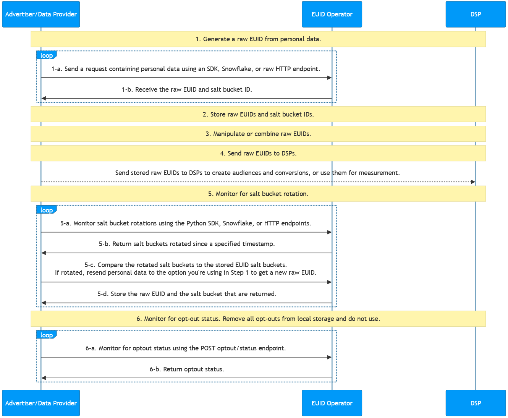

import Link from '@docusaurus/Link';

# Advertiser/Data Provider Integration Overview

This guide provides an overview of integration options for organizations that collect user data and push it to other EUID participants. Data collectors include advertisers, data on-boarders, measurement providers, identity graph providers, third-party data providers, and any other organizations that send data to other participants.

## Advertiser/Data Provider Routes to Use EUID

Within the ad tech industry, advertisers use identity to build audiences, track conversions, and generate their graphs. As an advertiser, or as a data provider acting on behalf of an advertiser, the following table shows some examples of how you can accomplish some of these goals with EUID.

:::note
There are other ways that you can use EUID, outside these use cases. These are just some examples.
:::

| Send/Receive? | Action | Advantage/Result |
| --- | --- | --- |
| Send in audiences | Send EUIDs via API or pixels | Create audiences. |
| Send&nbsp;in&nbsp;conversions | Send EUIDs as conversion information | Use conversion information for measurement (attribution) or for retargeting via API or pixels. |
| Receive&nbsp;graph&nbsp;data | Receive EUIDs from graph/data providers via API or pixels | Build graph data. |

## High-Level Steps

At a high level, the steps for advertisers and data providers integrating with EUID are as follows:

1. [Generate Raw EUIDs from Personal Data](#1-generate-raw-euids-from-personal-data)

2. [Store Raw EUIDs and Salt Bucket IDs](#2-store-raw-euids-and-salt-bucket-ids)

3. [Manipulate or Combine Raw EUIDs](#3-manipulate-or-combine-raw-euids)

4. [Send Stored Raw EUIDs to DSPs to Create Audiences or Conversions](#4-send-stored-raw-euids-to-dsps-to-create-audiences-or-conversions)

5. [Monitor for Salt Bucket Rotations for Your Stored Raw EUIDs](#5-monitor-for-salt-bucket-rotations-for-your-stored-raw-euids)

6. [Monitor for Opt-Out Status](#6-monitor-for-opt-out-status)

## Summary of Implementation Options

The following table shows the implementation options that are available for advertisers and data providers, for each of the high-level steps. Some steps are managed solely as part of your own custom implementation; some steps can be managed by one or more of the EUID implementation options available. For details, click the link on each step.

| High-Level Step | Implementation Options |
| --- | --- |
| [1: Generate Raw EUIDs from Personal Data](#1-generate-raw-euids-from-personal-data) | Use any of the following options to map personal data to raw EUIDs:<ul><li>One of these EUID SDKs:<ul><li>Python SDK: [Map Personal Data to Raw EUIDs](../sdks/sdk-ref-python.md#map-personal-data-to-raw-euids)</li><li>Java SDK: [Usage for Advertisers/Data Providers](../sdks/sdk-ref-java.md#usage-for-advertisersdata-providers)</li></ul></li><li>Snowflake: [Map Personal Data](integration-snowflake.md#map-personal-data)</li><li>HTTP endpoints: [POST&nbsp;/identity/map](../endpoints/post-identity-map.md)</li></ul> |
| [2: Store Raw EUIDs and Salt Bucket IDs](#2-store-raw-euids-and-salt-bucket-ids) | Custom (your choice). |
| [3: Manipulate or Combine Raw EUIDs](#3-manipulate-or-combine-raw-euids) | Custom (your choice). |
| [4: Send Stored Raw EUIDs to DSPs to Create Audiences or Conversions](#4-send-stored-raw-euids-to-dsps-to-create-audiences-or-conversions) | Custom (your choice). |
| [5: Monitor for Salt Bucket Rotations for Your Stored Raw EUIDs](#5-monitor-for-salt-bucket-rotations-for-your-stored-raw-euids) | Any of the following options:<ul><li>Python SDK: see <Link href="../sdks/sdk-ref-python">SDK for Python Reference Guide</Link></li><li>Snowflake: see <Link href="integration-snowflake">Snowflake Integration Guide</Link>, section titled <Link href="integration-snowflake#monitor-for-salt-bucket-rotation-and-regenerate-raw-euids">Monitor for Salt Bucket Rotation and Regenerate Raw EUIDs</Link></li><li>Raw HTTP endpoint: <Link href="../endpoints/post-identity-buckets">POST /identity/buckets</Link></li></ul> |
| [6: Monitor for Opt-Out Status](#6-monitor-for-opt-out-status) | API call to the [POST /optout/status](../endpoints/post-optout-status.md) endpoint. |

## Integration Diagram

The following diagram outlines the steps that data collectors must complete to map personal data to raw EUIDs for audience building and targeting.

Personal data refers to a user's normalized email address or phone number, or the normalized and SHA-256-hashed email address or phone number.

To keep your EUID-based audience information accurate and up to date, follow these integration steps every day.

<!-- diagram source: resource/advertiser-flow-overview-mermaid.md.bak -->

For details about the different parts of the diagram, refer to the following sections.

### 1: Generate Raw EUIDs from Personal Data

You can generate raw EUIDs from <Link href="../ref-info/glossary-uid#gl-personal-data">personal data</Link>, or receive EUIDs from another EUID participant such as a data provider acting on your behalf.

To generate raw EUIDs, use one of the following options:

- One of the EUID SDKs:

  - Python SDK: See [Map Personal Data to Raw EUIDs](../sdks/sdk-ref-python.md#map-personal-data-to-raw-euids).
  - Java SDK: See [Usage for Advertisers/Data Providers](../sdks/sdk-ref-java.md#usage-for-advertisersdata-providers).

- Snowflake: See [Map Personal Data](integration-snowflake.md#map-personal-data).

- HTTP endpoints: [POST&nbsp;/identity/map](../endpoints/post-identity-map.md). For details, see [Generate Raw EUIDs from Personal Data](integration-advertiser-dataprovider-endpoints.md#1-generate-raw-euids-from-personal-data).

### 2: Store Raw EUIDs and Salt Bucket IDs

The response from Step 1, [Generate Raw EUIDs from Personal Data](#1-generate-raw-euids-from-personal-data), contains mapping information. We recommend that you store the following information returned in Step 1:

- Cache the mapping between personal data (`identifier`), raw EUID (`advertising_id`), and salt bucket (`bucket_id`).
- Store the timestamp for when you received the response data. Later, you can compare this timestamp with the `last_updated` timestamp returned in Step 5, [Monitor for Salt Bucket Rotations for Your Stored Raw EUIDs](#5-monitor-for-salt-bucket-rotations-for-your-stored-raw-euids).

### 3: Manipulate or Combine Raw EUIDs

Use the EUIDs you received in Step 1. For example, you might do one or more of the following:

- Do some manipulation: for example, combine EUIDs you generated from personal data and EUIDs received from another participant such as an advertiser or data provider.
- Add new EUIDs into an existing audience.

### 4: Send Stored Raw EUIDs to DSPs to Create Audiences or Conversions

Use the raw EUIDs for some purpose such as:

   - Sending stored raw EUIDs to DSPs to create audiences and conversions.
   - Using the raw EUIDs for measurement.

For example, you could send the `advertising_id` (<Link href="../ref-info/glossary-uid#gl-raw-euid">raw EUID</Link>) returned in Step 1-b to a DSP while building your audiences. Each DSP has a unique integration process for building audiences; follow the integration guidance provided by the DSP for sending raw EUIDs to build an audience.

You could also send conversion information via API or pixels for measurement (attribution) or for retargeting.

### 5: Monitor for Salt Bucket Rotations for Your Stored Raw EUIDs

A raw EUID is an identifier for a user at a specific moment in time. The raw EUID for a specific user changes at least once per year, as a result of the <Link href="../ref-info/glossary-uid#gl-salt-bucket">salt bucket</Link> rotation. 

Even though each salt bucket is updated approximately once per year, individual bucket updates are spread over the year. Approximately 1/365th of all salt buckets are rotated daily. Based on this, we recommend checking salt bucket rotation regularly, on a cadence that aligns with your audience refreshes. For example, if you refresh weekly, check for salt bucket updates weekly.

If the salt bucket has been rotated, regenerate the raw EUID. For details, see [Determine whether the salt bucket has been rotated](#determine-whether-the-salt-bucket-has-been-rotated).

For instructions for monitoring for salt bucket rotations, refer to one of the following:

- Python SDK: [Monitor Rotated Salt Buckets](../sdks/sdk-ref-python.md#monitor-rotated-salt-buckets).

- Snowflake: [Monitor for Salt Bucket Rotation and Regenerate Raw EUIDs](integration-snowflake.md#monitor-for-salt-bucket-rotation-and-regenerate-raw-euids).

- HTTP endpoints: [Monitor for Salt Bucket Rotations for Your Stored Raw EUIDs](integration-advertiser-dataprovider-endpoints.md#5-monitor-for-salt-bucket-rotations-for-your-stored-raw-euids).

:::note
For AWS Entity Resolution, there is no way to do salt bucket monitoring. As an alternative, you could regenerate raw EUIDs periodically using the AWS Entity Resolution service.
:::

#### Determine whether the salt bucket has been rotated

To determine whether the salt bucket ID for a specific raw EUID has changed, follow these steps.

1. Compare these two values:

   - The `last_updated` timestamp of each `bucket_id` returned as part of monitoring the salt bucket rotations (whatever option you choose).
   
   - The timestamp of the raw EUID generation of the same `bucket_id`, which was returned in Step 1 and stored in Step 2.

1. If the `last_updated` timestamp is more recent than the timestamp you recorded earlier, the salt bucket has been rotated. As a result, you'll need to regenerate any raw EUIDs associated with this `bucket_id`, following Step 1, [Generate Raw EUIDs from Personal Data](#1-generate-raw-euids-from-personal-data).

### 6: Monitor for Opt-Out Status

It's important to honor user opt-out status. Periodically, monitor for opt-out status, to be sure that you don't continue using EUIDs for users that have recently opted out.

There are two ways that you can check with the EUID <Link href="../ref-info/glossary-uid#gl-operator-service">Operator Service</Link> to make sure you have the latest opt-out information:

- Call the [POST&nbsp;/identity/map](../endpoints/post-identity-map.md) endpoint to check for opt-outs. If the personal data has been opted out, no raw EUID is generated.

- Check the opt-out status of raw EUIDs using the [POST&nbsp;/optout/status](../endpoints/post-optout-status.md) endpoint.

For details about the EUID opt-out workflow and how users can opt out, see [User Opt-Out](../getting-started/gs-opt-out.md).

## FAQs

For a list of frequently asked questions for advertisers and data providers using the EUID framework, see [FAQs for Advertisers and Data Providers](../getting-started/gs-faqs.md#faqs-for-advertisers-and-data-providers).
