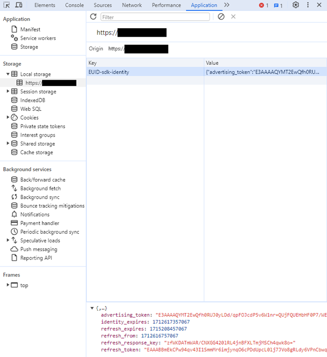
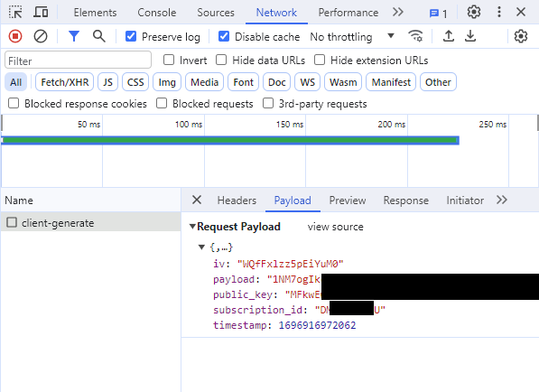

import Tabs from '@theme/Tabs';
import TabItem from '@theme/TabItem';
import Link from '@docusaurus/Link';

# Client-Side Integration Guide for JavaScript

This guide is for publishers who want to integrate with EUID and generate <Link href="../ref-info/glossary-uid#gl-euid-token">EUID tokens</Link> (advertising tokens) using only JavaScript client-side changes on their website with minimum effort.

This guide does not apply to publishers who want to use a private operator, or who want to generate tokens server-side. Those publishers should follow the [Client-Server Integration Guide for JavaScript](integration-javascript-client-server.md).

EUID provides an SDK for JavaScript (see [SDK for JavaScript Reference Guide](../sdks/sdk-ref-javascript.md)) with the following features:

- EUID token generation
- Automatic refreshing of EUID tokens
- Automatic storage of EUID tokens in the browser

You'll need to complete the following steps:

1. [Complete EUID account setup](#complete-euid-account-setup)
2. [Add SDK for JavaScript to your site](#add-sdk-for-javascript-to-your-site)
3. [Configure the SDK for JavaScript](#configure-the-sdk-for-javascript)
4. [Check that the token was successfully generated](#check-that-the-token-was-successfully-generated)

## SDK for JavaScript Version

Support for client-side token generation is available in version 3.2 and above of the SDK. 

The URL for the SDK is:

- [https://cdn.prod.euid.eu/euid-sdk-3.3.0.js](https://cdn.prod.euid.eu/euid-sdk-3.3.0.js)

In the following code examples, the placeholder `{{ EUID_JS_SDK_URL }}` refers to this URL.

If you want to use a debug build of the SDK, use the following URL instead:

- [https://cdn.integ.euid.eu/euid-sdk-3.3.0.js](https://cdn.integ.euid.eu/euid-sdk-3.3.0.js)

## Sample Implementation Website

For an example website, see this example:
- Code: [Example Client-Side Integration for JavaScript](https://github.com/European-Unified-ID/EUID-docs/tree/main/static/examples/cstg-js-sdk-example)
- Running site: [Client-Side Integration Example, EUID JavaScript SDK](https://euid.eu/examples/cstg-js-sdk-example/)

## Complete EUID Account Setup

Complete the EUID account setup by following the steps described in the [Account Setup](../getting-started/gs-account-setup.md) page. As part of the account setup process, you'll need to provide a list of **domain names** for the sites that you'll be using with this SDK for JavaScript.

When account setup is complete, you'll receive a **public key** and **subscription ID**. These values are unique to you, and you'll use them to configure the EUID module.

:::tip
Only root-level domains are required for account setup. For example, if you're going to use the EUID SDK for JavaScript on example.com, shop.example.com, and example.org, you only need to provide the domain names example.com and example.org.
:::

## Add SDK for JavaScript to Your Site

The following code snippet provides an overview of the code you will need to add to your website. It also illustrates the different events that the SDK can trigger.

For a more detailed code snippet, see [Example Integration Code and When to Pass Personal Data to the EUID SDK](#example-integration-code-and-when-to-pass-personal-data-to-the-euid-sdk).

For the `EUID_JS_SDK_URL` value, see [SDK for JavaScript Version](#sdk-for-javascript-version).

```js
<script async src="{{ EUID_JS_SDK_URL }}"></script>
 
<script>
 
// When the EUID SDK is executed, it looks for these callbacks and invokes them.
window.__euid = window.__euid || {};
window.__euid.callbacks = window.__euid.callbacks || [];
window.__euid.callbacks.push((eventType, payload) => {
  switch (eventType) {
    case "SdkLoaded":
      // The SdkLoaded event occurs just once.
      __euid.init({});
      break;
 
    case "InitCompleted":
      // The InitCompleted event occurs just once.
      //
      // If there is a valid EUID token, it is in payload.identity.
      break;
 
    case "IdentityUpdated":
      // The IdentityUpdated event happens when an EUID token is generated or refreshed.
      // payload.identity contains the resulting latest identity.
      break;
  }
});
 
</script>
```

For more information about the SDK, see [SDK for JavaScript Reference Guide](../sdks/sdk-ref-javascript.md).

### Using the EUID Integration Environment

By default, the SDK is configured to work with the EUID production environment `https://prod.uidapi.com`. If you want to use the EUID integration environment instead, provide the following URL in your call to `init`:

```js
__euid.init({
  baseUrl: "https://integ.euid.eu",
});
```

:::note
Tokens from the EUID integration environment are not valid for passing to the <Link href="../ref-info/glossary-uid#gl-bidstream">bidstream</Link>. For the integration environment, you will have different **subscription ID** and **public key** values.
:::

<!-- Reduce Latency by Setting the API Base URL for the Production Environment not applicable for EUID -->

## Configure the SDK for JavaScript

EUID provides the publisher with the following values required to use the client-side token generation feature:

* A subscription ID
* A public key

You'll have one set of these values for your publisher integration environment, and a separate set for your production environment.

To configure the SDK, call one of the following methods, with an object containing the **public key** and **subscription ID** that you received during account setup, as well as the user's hashed or unhashed personal data (email address):

*  `__euid.setIdentityFromEmail`
*  `__euid.setIdentityFromEmailHash`

The following sections include coding examples for each scenario.

Once it's configured, the EUID SDK takes care of the following:
- Generates an EUID token for the user.
- Stores the token in the user's browser.
- Automatically refreshes the token as required while your site is open in the user's browser.

You can pass the user's personal data to the EUID SDK either hashed or unhashed. If you pass the personal data unhashed, the EUID SDK hashes it for you. If you want to pass the personal data to the SDK already hashed, you must normalize it before hashing. For details, see [Normalization and Encoding](../getting-started/gs-normalization-encoding.md). 

## Format Examples for Personal Data

The SDK encrypts the hashed personal data before sending it to the EUID service.

You can configure the SDK using either of the two accepted personal data formats, for any specific user. The personal data format might vary per user but you can only send one value per user.

The following examples demonstrate the different ways that you can configure the EUID SDK and list the requirements for the personal data passed to the SDK:

- Configure for Email Address
- Configure for Hashed Email Address

If the SDK is configured multiples times, it uses the most recent configuration values.

For an example of how to generate an email hash in JavaScript, see [Example Code: Hashing and Base-64 Encoding](#example-code-hashing-and-base-64-encoding).

<Tabs>
<TabItem value='example_email_unhashed' label='Email, Unhashed'>

The following example configures the EUID SDK with an email address.

```js
await __euid.setIdentityFromEmail(
    "test@example.com",
    {
        subscriptionId: subscriptionId,
        serverPublicKey: publicKey,
    }
);
```

In this scenario:

- No normalization or hashing is required by the publisher.
- The EUID SDK normalizes and hashes the email address before sending the encrypted hash to the EUID service.

</TabItem>
<TabItem value='example_email_hash' label='Email, Normalized and Hashed'>

The following example configures the EUID SDK with a hashed email address.

```js
await __euid.setIdentityFromEmailHash(
    'tMmiiTI7IaAcPpQPFQ65uMVCWH8av9jw4cwf/F5HVRQ=',
    {
        subscriptionId: subscriptionId,
        serverPublicKey: publicKey,
    }
);
```

In this scenario:
- **The publisher is responsible for normalizing and hashing the email address**. For details, see [Normalization and Encoding](../getting-started/gs-normalization-encoding.md).
- The EUID SDK encrypts the hash before sending it to the EUID service.

</TabItem>
</Tabs>

## Token Storage and Refresh

After calling one of the methods listed in [Configure the SDK for JavaScript](#configure-the-sdk-for-javascript) successfully, an identity is generated and stored in local storage, under the key `EUID-sdk-identity`. The SDK refreshes the EUID token periodically.

:::warning
The format of the object stored in local storage could change without notice. We recommend that you do **not** read and update the object in local storage directly.
:::

## Example Integration Code and When to Pass Personal Data to the EUID SDK

When this is the first page load with no identity, to start the token generation call you'll need to call one of the `setIdentity` methods with personal data. Once an identity is generated, the advertising token (EUID token) that you would send to the bidstream will be available by waiting for the `IdentityUpdated` event from the SDK. For an example, see how the value for `advertising_token_to_use` is set in the following code snippet.

In some cases, the user's personal data is not available on page load, and getting the personal data has some associated cost. For example, an API call might be required to fetch the personal data, or the user has to be prompted to provide it.

You can potentially avoid that cost by checking for an existing token that you can use or refresh. To do this, call
[__euid.isLoginRequired](../sdks/sdk-ref-javascript#isloginrequired-boolean) which returns a Boolean value. If it returns `true`, this means that the EUID SDK cannot create a new advertising token with the existing resource and personal data is required to generate a brand new EUID token.

The following code snippet demonstrates how you might integrate with the SDK for JavaScript for the two scenarios above&#8212;starting with no token as well as reusing/refreshing any existing EUID token if found. 

```js
<script async src="{{ EUID_JS_SDK_URL }}"></script>
 
<script>
 
// EUID provides these configuration values to the publisher.
const clientSideConfig = {
  subscriptionId: "...",
  serverPublicKey: "...",
};
  
// Example of a base-64 encoded SHA-256 hash of an email address.
const emailHash = "tMmiiTI7IaAcPpQPFQ65uMVCWH8av9jw4cwf/F5HVRQ=";

// When the EUID SDK is executed, it looks for these callbacks and invokes them.
window.__euid = window.__euid || {};
window.__euid.callbacks = window.__euid.callbacks || [];
window.__euid.callbacks.push(async (eventType, payload) => {
  switch (eventType) {
    case "SdkLoaded":
      // The SdkLoaded event occurs just once.
      __euid.init({});
      break;
 
    case "InitCompleted":
      // The InitCompleted event occurs just once.
      //
      // If there is a valid EUID token, it is in payload.identity.
      if (payload.identity) {
        //
        // payload looks like this:
        // {
        //   "identity": {
        //     "advertising_token": "A4A...MqA",
        //     "refresh_token": "A3A...pdg==",
        //     "identity_expires": 1692257038260,
        //     "refresh_expires": 1692339838260,
        //     "refresh_from": 1692254338260
        //     "refresh_response_key": "z0v...zL0="
        //   }
        // }
        var advertising_token_to_use = payload.identity.advertising_token;
      } else {
          if (__euid.isLoginRequired()) {
            // Call one of the setIdentityFrom functions to generate a new EUID token.
            // Add any retry logic around this call as required.
            await __euid.setIdentityFromEmailHash(
                emailHash,
                clientSideConfig
          );
          else {
            // there is a token generation API call in flight which triggers
            // a IdentityUpdated event 
          }
        }
      }
      break;
 
    case "IdentityUpdated":
      // The IdentityUpdated event happens when an EUID token is generated or refreshed.
      // See previous comment for an example of how the payload looks.
      var advertising_token_to_use = payload.identity.advertising_token;
      break;
  }
});
 
</script>
```

## Check that the Token Was Successfully Generated

To check that the token was successfully generated, use the browser's developer tools to look for the token in local storage.



If there was a problem generating the token, find the request in the **Network** tab. You can find the request by filtering for the string `client-generate`. Information about why the request failed should be available in the response.




## Example Code: Hashing and Base-64 Encoding

The following code example demonstrates how to generate an email hash in JavaScript.

```js
async function hash(value) {
  const hash = await window.crypto.subtle.digest(
    "SHA-256",
    new TextEncoder().encode(value)
  );
  return bytesToBase64(new Uint8Array(hash));
}
 
function bytesToBase64(bytes) {
  const binString = Array.from(bytes, (x) => String.fromCodePoint(x)).join("");
  return btoa(binString);
}
```