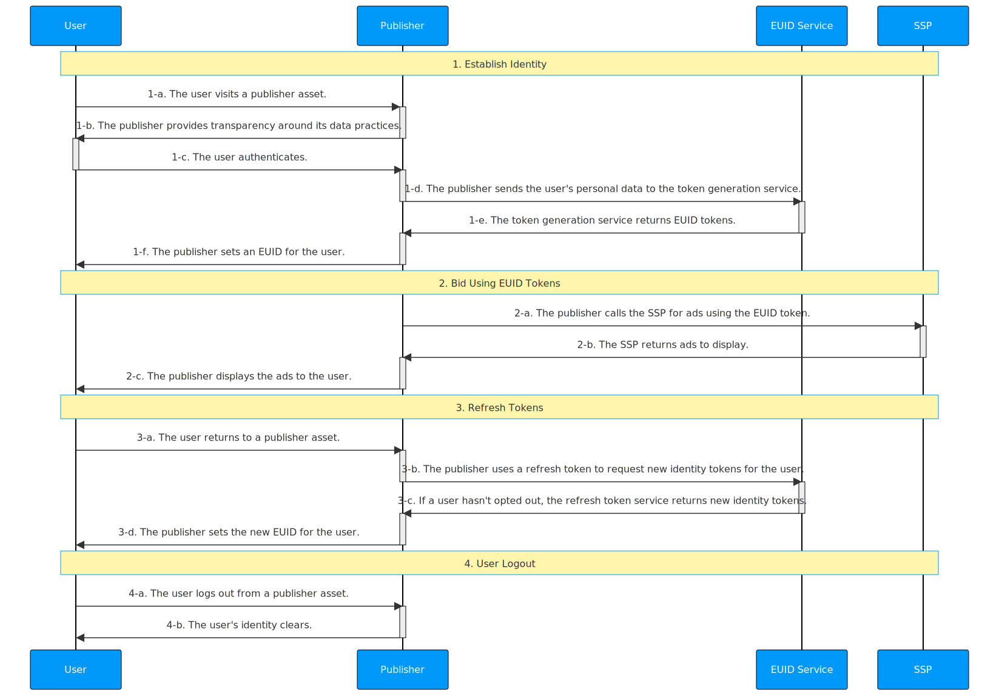

import Link from '@docusaurus/Link';

# Publisher Integration Guide, Server-Side

This guide is for publishers who want to integrate with EUID to generate <Link href="../ref-info/glossary-uid#gl-euid-token">EUID tokens</Link> (advertising tokens) for the RTB <Link href="../ref-info/glossary-uid#gl-bidstream">bidstream</Link>, with all integration activity on the server side.

The following options are available for publishers to integrate with EUID on the server side:

- EUID SDK for Java (see [Usage for Publishers](../sdks/sdk-ref-java.md#usage-for-publishers) section).
- EUID SDK for Python (see [Usage for Publishers](../sdks/sdk-ref-python.md#usage-for-publishers) section).
- Custom server code to generate and refresh the EUID token by calling the [POST&nbsp;/token/generate](../endpoints/post-token-generate.md) and [POST&nbsp;/token/refresh](../endpoints/post-token-refresh.md) endpoints.

For a complete summary of publisher integration options, see [Publisher Integrations](summary-guides.md#publisher-integrations).

:::tip
To facilitate the process of establishing client identity using EUID and retrieving EUID tokens, consider using the EUID SDK for JavaScript. For details, see [Client-Server Integration Guide for JavaScript](integration-javascript-client-server.md).
:::

## Introduction

The guide outlines the [basic steps](#integration-steps) that you need to consider if you're building an integration without using a client-side or server-side SDK. For example, you need to decide how to do the following:

- Implement opportunities to capture email: for example, promotional exchanges, sign-ups and subscriptions, or marketing form fills.
- Manage EUID identity information and use it for targeted advertising
- Refresh EUID tokens
- Deal with missing identities
- Manage user opt-outs

See also [FAQs](#faqs).

## Integration Steps

The following diagram outlines the steps required for a user to establish an EUID token with a publisher and how the EUID token integrates with the RTB bidstream.

If you're using a server-side SDK, the SDK takes care of all the steps that mention endpoints: for example, step 1-d, the publisher sends the user's personal data to the token generation service.
 

The following sections provide additional details for each step in the diagram:
 
1. [Establish identity: capture user data](#establish-identity-capture-user-data)
2. [Bid using an EUID token](#bid-using-an-euid-token)
3. [Refresh an EUID token](#refresh-an-euid-token)
4. [Clear Identity: user logout](#clear-identity-user-logout)

### Establish Identity: Capture User Data

After authentication in step 1-c, which allows the publisher to validate the user's email address, the publisher can send a request to generate an EUID token, on the server side. The following table details the token generation steps.

:::tip
Rather than calling this endpoint directly, you could use one of the SDKs to manage it for you. For a summary of options, see [SDKs: Summary](../sdks/summary-sdks.md).
:::

| Step | Endpoint | Description |
| :--- | :--- | :--- |
| 1-d | [POST&nbsp;/token/generate](../endpoints/post-token-generate.md) | Establish identity with EUID by using the [POST&nbsp;/token/generate](../endpoints/post-token-generate.md) endpoint to generate an EUID token using the normalized email address of the user. |
| 1-e | [POST&nbsp;/token/generate](../endpoints/post-token-generate.md) | Return an EUID token generated from the user's hashed or unhashed email address, plus associated values such as the refresh token. |
| 1-f | N/A | Place the returned `advertising_token` and `refresh_token` in a store tied to a user. You might consider client-side storage, such as a first-party cookie, or server-side storage. |

### Bid Using an EUID Token

Consider how you want to manage EUID identity information and use it for targeted advertising; for example, to pass the returned EUID token to SSPs.

| Step | Endpoint | Description |
| :--- | :--- | :--- |
| 2-a | N/A| Send the `advertising_token` from step [1-e](#establish-identity-capture-user-data) to the SSP for bidding. Send the value as is. |

:::note
For an example of what an EUID token might look like in the bidstream, when it's sent from an SSP to a DSP, see [What does an EUID token look like in the bidstream?](../getting-started/gs-faqs.md#what-does-an-euid-token-look-like-in-the-bidstream).
:::

### Refresh an EUID Token

Use the `POST&nbsp;/token/refresh` endpoint to make sure you always have a valid and up-to-date EUID token. The EUID token must be refreshed to sync with the EUID rotation. In addition, the token refresh process checks the user's opt-out status, and if the user has opted out, no new token is sent. This ends the token refresh chain, and you must not use that EUID token again.

| Step | Endpoint | Description |
| :--- | :--- | :--- |
| 3-a |N/A | When a user returns to an asset and becomes active again, refresh the EUID token before sending it to the SSP. | 
| 3-b | [POST&nbsp;/token/refresh](../endpoints/post-token-refresh.md)  | Send the `refresh_token` obtained in step [1-e](#establish-identity-capture-user-data) as a query parameter. |
| 3-c | [POST&nbsp;/token/refresh](../endpoints/post-token-refresh.md) | The EUID service issues a new identity token for users that haven't opted out. |
| 3-d | N/A| Place the values returned by the `POST /token/refresh` endpoint, `advertising_token` and `refresh_token`, so that they are linked to the user. You might consider client-side storage, such as a first-party cookie, or server-side storage. |

:::tip
Refresh tokens starting from the `refresh_from` timestamp, which is part of the identity returned by the [POST&nbsp;/token/generate](../endpoints/post-token-generate.md) or [POST&nbsp;/token/refresh](../endpoints/post-token-refresh.md) endpoints.
:::

### Clear Identity: User Logout

If the user logs out, do not use the EUID token.

| Step | Endpoint | Description |
| :--- | :--- | :--- |
| 4-a | N/A | The user logs out from a publisher asset. |
| 4-b | N/A | Remove the EUID token you've stored for that user. No interaction with the EUID service is required. |

## FAQs

For a list of frequently asked questions for the publisher audience, see [FAQs for Publishers](../getting-started/gs-faqs.md#faqs-for-publishers).
