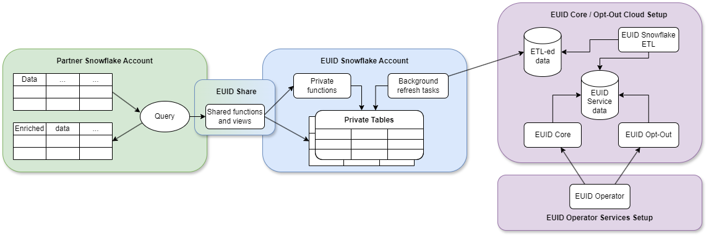

import Link from '@docusaurus/Link';

# Snowflake Integration Guide (Pre-July 2025)

[Snowflake](https://www.snowflake.com/) is a cloud data warehousing solution, where you as a partner can store your data and integrate with the EUID framework. Using Snowflake, EUID enables you to securely share consumer identifier data without exposing sensitive <Link href="../ref-info/glossary-uid#gl-personal-data">personal data</Link>. Even though you have the option to query the Operator Web Services directly for the consumer identifier data, the Snowflake EUID integration offers a more seamless experience.

:::important
This document is for anyone using the Snowflake marketplace listing published prior to July 2025. For documentation on the newer version of identity map published in July 2025, see [Snowflake Integration Guide](integration-snowflake.md). If you're using the earlier implementation, we recommend that you upgrade as soon as possible, to take advantage of improvements. For migration information, see [Migration Guide](integration-snowflake.md#migration-guide).
:::

## Snowflake Marketplace Listing

The following listing for EUID is available on Snowflake Marketplace:
- [European Unified ID Advertiser and Data Provider Identity Solution](https://app.snowflake.com/marketplace/listing/GZTDZJ7404/european-unified-id-european-unified-id-advertiser-and-data-provider-identity-solution)

:::tip
For a summary of all integration options and steps for advertisers and data providers, see [Advertiser/Data Provider Integration Overview](integration-advertiser-dataprovider-overview.md).
:::
## Functionality

The following table summarizes the functionality available with the EUID Snowflake integration.

| Encrypt Raw EUID to EUID Token | Decrypt EUID Token to Raw EUID | Generate EUID Token from Personal Data | Refresh EUID Token | Map Personal Data to Raw EUID |
| :--- | :--- | :--- | :--- | :--- |
| &#8212; | &#8212; | &#8212; | &#8212; | &#9989; |

*You cannot use Snowflake to generate an EUID token directly from personal data. However, you can convert personal data to a raw EUID, and then encrypt the raw EUID into an EUID token.


## Workflow Diagram

The following diagram and table illustrate the different parts of the EUID integration process in Snowflake, and the workflow.



| Partner Snowflake Account | EUID Snowflake Account | EUID Core Opt-Out Cloud Setup |
| :--- | :--- | :--- |
|As a partner, you set up a Snowflake account to host your data and engage in EUID integration by consuming functions and views through the EUID Share. | EUID integration, hosted in a Snowflake account, grants you access to authorized functions and views that draw data from private tables. You can't access the private tables. The EUID Share reveals only essential data needed for you to perform EUID-related tasks.<br/>**NOTE**: We store <Link href="../ref-info/glossary-uid#gl-salt">salts</Link> and encryption keys in the private tables. No <Link href="../ref-info/glossary-uid#gl-personal-data">personal data</Link> is stored at any point. |ETL (Extract Transform Load) jobs constantly update the EUID Core/Optout Snowflake storage with internal data that powers the EUID Operator Web Services. The data used by the Operator Web Services is also available through the EUID Share. |
|When you use shared functions and views, you pay Snowflake for transactional computation costs.  |These private tables, secured in the EUID Snowflake account, automatically synchronize with the EUID Core/Optout Snowflake storage that holds internal data used to complete EUID-related tasks.  | |

## Access the EUID Share

Access to the EUID Share is available through the [Snowflake Data Marketplace](https://www.snowflake.com/data-marketplace/).

For a link to the specific listing, see [Snowflake Marketplace Listing](#snowflake-marketplace-listing).

:::important
To be able to request data, you must use the `ACCOUNTADMIN` role or another role with the `CREATE DATABASE` and `IMPORT SHARE` privileges in your Snowflake account.
:::

To request access to the EUID Share, complete the following steps:

1.	Log in to the Snowflake Data Marketplace and select the EUID share. For a link, see [Snowflake Marketplace Listing](#snowflake-marketplace-listing).
2.	In the **Personalized Data** section, click **Request Data**.
3.	Follow the onscreen instructions to verify and provide your contact details and other required information.
4.	If you are an existing client of The Trade Desk, include your identifying IDs, such as partner and advertiser IDs issued by The Trade Desk, in the **Message** field of the data request form.
5.	Submit the form.

After your request is received, an EUID administrator will contact you with the appropriate access instructions. For details about managing data requests in Snowflake, see the [Snowflake documentation](https://docs.snowflake.com/en/user-guide/data-marketplace-consumer.html).

## Shared Objects

You can map personal data to EUIDs by using the following function:

- `FN_T_IDENTITY_MAP` (See [Map Personal Data](#map-personal-data))


To identify the EUIDs that you must regenerate, use the `SALT_BUCKETS` view from the EUID Share. For details, see [Monitor for Salt Bucket Rotation and Regenerate Raw EUIDs](#monitor-for-salt-bucket-rotation-and-regenerate-raw-euids).


### Database and Schema Names

The following sections include query examples for each solution, which are identical except for the database and schema name variables:

```
{DATABASE_NAME}.{SCHEMA_NAME}
```

For example:

```sql
select UID, BUCKET_ID, UNMAPPED from table({DATABASE_NAME}.{SCHEMA_NAME}.FN_T_IDENTITY_MAP('validate@example.com', 'email'));
```

All query examples use the following default values for each name variable:

| Variable | Default Value | Comments |
| :--- | :--- | :--- |
| `{DATABASE_NAME}` | `EUID_PROD_UID_SH` | If needed, you can change the default database name when creating a new database after you are granted access to the selected EUID Share. |
| `{SCHEMA_NAME}`| `UID` | This is an immutable name. |

### Map Personal Data

To map all types of <Link href="../ref-info/glossary-uid#gl-personal-data">personal data</Link>, use the `FN_T_IDENTITY_MAP` function.

If the personal data is an email address, the service normalizes the data using the EUID [Email Address Normalization](../getting-started/gs-normalization-encoding.md#email-address-normalization) rules.

If the personal data is a phone number, you must normalize it before sending it to the service, using the EUID [Phone Number Normalization](../getting-started/gs-normalization-encoding.md#phone-number-normalization) rules.

|Argument|Data Type|Description|
| :--- | :--- | :--- |
| `INPUT` | varchar(256) | The personal data to map to the EUID and <Link href="../ref-info/glossary-uid#gl-salt-bucket-id">salt bucket ID</Link>. |
| `INPUT_TYPE` | varchar(256) | The type of personal data to map. Allowed values: `email`, `email_hash`, `phone`, and `phone_hash`.

A successful query returns the following information for the specified personal data.

|Column Name|Data Type|Description|
| :--- | :--- | :--- |
| `UID` | TEXT | The value is one of the following:<ul><li>Personal data was successfully mapped: The EUID associated with the personal data.</li><li>Personal data was not successfully mapped: `NULL`.</li></ul> |
| `BUCKET_ID` | TEXT | The value is one of the following:<ul><li>Personal data was successfully mapped: The ID of the <Link href="../ref-info/glossary-uid#gl-salt-bucket">salt bucket</Link> used to generate the EUID. This ID maps to the bucket ID in the `SALT_BUCKETS` view.</li><li>Personal data was not successfully mapped: `NULL`.</li></ul> |
| `UNMAPPED` | TEXT | The value is one of the following:<ul><li>Personal data was successfully mapped: `NULL`.</li><li>Personal data was not successfully mapped:  The reason why the identifier was not mapped: `OPTOUT`, `INVALID IDENTIFIER`, or `INVALID INPUT TYPE`.<br/>For details, see [Values for the UNMAPPED Column](#values-for-the-unmapped-column).</li></ul> |

#### Values for the UNMAPPED Column

The following table shows possible values for the `UNMAPPED` column.

| Value | Meaning |
| :-- | :-- |
| `NULL` | The personal data was successfully mapped. |
| `OPTOUT` | The user has opted out. |
| `INVALID IDENTIFIER` | The email address or phone number is invalid. |
| `INVALID INPUT TYPE` | The value of `INPUT_TYPE` is invalid. Valid values for INPUT_TYPE are: `email`, `email_hash`, `phone`, `phone_hash`. |

#### Examples

Mapping request examples in this section:

- [Single Unhashed Email](#mapping-request-example---single-unhashed-email)
- [Multiple Unhashed Emails](#mapping-request-example---multiple-unhashed-emails)
- [Single Unhashed Phone Number](#mapping-request-example---single-unhashed-phone-number)
- [Multiple Unhashed Phone Numbers](#mapping-request-example---multiple-unhashed-phone-numbers)
- [Single Hashed Email](#mapping-request-example---single-hashed-email)
- [Multiple Hashed Emails](#mapping-request-example---multiple-hashed-emails)
- [Single Hashed Phone Number](#mapping-request-example---single-hashed-phone-number)
- [Multiple Hashed Phone Numbers](#mapping-request-example---multiple-hashed-phone-numbers)

:::note
The input and output data in these examples is fictitious, for illustrative purposes only. The values provided are not real values.
:::

#### Mapping Request Example - Single Unhashed Email

The following query illustrates how to map a single email address, using the [default database and schema names](#database-and-schema-names).

```sql
select UID, BUCKET_ID, UNMAPPED from table(EUID_PROD_UID_SH.UID.FN_T_IDENTITY_MAP('validate@example.com', 'email'));
```

Query results for a single email:

```
+----------------------------------------------+------------+----------+
| UID                                          | BUCKET_ID  | UNMAPPED |
+----------------------------------------------+------------+----------+
| 2ODl112/VS3x2vL+kG1439nPb7XNngLvOWiZGaMhdcU= | ad1ANEmVZ  | NULL     |
+----------------------------------------------+------------+----------+
```

#### Mapping Request Example - Multiple Unhashed Emails

The following query illustrates how to map multiple email addresses, using the [default database and schema names](#database-and-schema-names).

```sql
select a.ID, a.EMAIL, m.UID, m.BUCKET_ID, m.UNMAPPED from AUDIENCE a LEFT JOIN( 
    select ID, t.* from AUDIENCE, lateral EUID_PROD_UID_SH.UID.FN_T_IDENTITY_MAP(EMAIL, 'email') t ) m 
    on a.ID = m.ID;
```

Query results for multiple emails:

The following table identifies each item in the response, including `NULL` values for `NULL` or improperly formatted emails.

```sh
+----+----------------------+----------------------------------------------+------------+--------------------+
| ID | EMAIL                | UID                                          | BUCKET_ID  | UNMAPPED           |
+----+----------------------+----------------------------------------------+------------+--------------------+
|  1 | validate@example.com | 2ODl112/VS3x2vL+kG1439nPb7XNngLvOWiZGaMhdcU= | ad1ANEmVZ  | NULL               |
|  2 | test@uidapi.com      | IbW4n6LIvtDj/8fCESlU0QG9K/fH63UdcTkJpAG8fIQ= | a30od4mNRd | NULL               |
|  3 | invalid-email        | NULL                                         | NULL       | INVALID IDENTIFIER |
|  4 | NULL                 | NULL                                         | NULL       | INVALID IDENTIFIER |
+----+----------------------+----------------------------------------------+------------+--------------------+
```

#### Mapping Request Example - Single Unhashed Phone Number

The following query illustrates how to map a phone number, using the [default database and schema names](#database-and-schema-names).

You must normalize phone numbers using the EUID [Phone Number Normalization](../getting-started/gs-normalization-encoding.md#phone-number-normalization) rules.

```sql
select UID, BUCKET_ID, UNMAPPED from table(EUID_PROD_UID_SH.UID.FN_T_IDENTITY_MAP('+12345678901', 'phone'));
```

Query results for a single phone number:

```
+----------------------------------------------+------------+----------+
| UID                                          | BUCKET_ID  | UNMAPPED |
+----------------------------------------------+------------+----------+
| 2ODl112/VS3x2vL+kG1439nPb7XNngLvOWiZGaMhdcU= | ad1ANEmVZ  | NULL     |
+----------------------------------------------+------------+----------+
```

#### Mapping Request Example - Multiple Unhashed Phone Numbers

The following query illustrates how to map multiple phone numbers, using the [default database and schema names](#database-and-schema-names).

You must normalize phone numbers using the EUID [Phone Number Normalization](../getting-started/gs-normalization-encoding.md#phone-number-normalization) rules.

```sql
select a.ID, a.PHONE, m.UID, m.BUCKET_ID, m.UNMAPPED from AUDIENCE a LEFT JOIN(
    select ID, t.* from AUDIENCE, lateral EUID_PROD_UID_SH.UID.FN_T_IDENTITY_MAP(PHONE, 'phone') t) m 
    on a.ID=m.ID;
```

Query results for multiple phone numbers:

The following table identifies each item in the response, including `NULL` values for `NULL` or invalid phone numbers.

```
+----+--------------+----------------------------------------------+------------+--------------------+
| ID | PHONE        | UID                                          | BUCKET_ID  | UNMAPPED           |
+----+--------------+----------------------------------------------+------------+--------------------+
|  1 | +12345678901 | 2ODl112/VS3x2vL+kG1439nPb7XNngLvOWiZGaMhdcU= | ad1ANEmVZ  | NULL               |
|  2 | +61491570006 | IbW4n6LIvtDj/8fCESlU0QG9K/fH63UdcTkJpAG8fIQ= | a30od4mNRd | NULL               |
|  3 | 1234         | NULL                                         | NULL       | INVALID IDENTIFIER |
|  4 | NULL         | NULL                                         | NULL       | INVALID IDENTIFIER |
+----+--------------+----------------------------------------------+------------+--------------------+
```

#### Mapping Request Example - Single Hashed Email

The following query illustrates how to map a single email address hash, using the [default database and schema names](#database-and-schema-names).

```sql
select UID, BUCKET_ID, UNMAPPED from table(EUID_PROD_UID_SH.UID.FN_T_IDENTITY_MAP(BASE64_ENCODE(SHA2_BINARY('validate@example.com', 256)), 'email_hash'));
```

Query results for a single hashed email:

```
+----------------------------------------------+------------+----------+
| UID                                          | BUCKET_ID  | UNMAPPED |
+----------------------------------------------+------------+----------+
| 2ODl112/VS3x2vL+kG1439nPb7XNngLvOWiZGaMhdcU= | ad1ANEmVZ  | NULL     |
+----------------------------------------------+------------+----------+
```

#### Mapping Request Example - Multiple Hashed Emails

The following query illustrates how to map multiple email address hashes, using the [default database and schema names](#database-and-schema-names).

```sql
select a.ID, a.EMAIL_HASH, m.UID, m.BUCKET_ID, m.UNMAPPED from AUDIENCE a LEFT JOIN(
    select ID, t.* from AUDIENCE, lateral EUID_PROD_UID_SH.UID.FN_T_IDENTITY_MAP(EMAIL_HASH, 'email_hash') t) m 
    on a.ID=m.ID;
```

Query results for multiple hashed emails:

The following table identifies each item in the response, including `NULL` values for `NULL` hashes.

```
+----+----------------------------------------------+----------------------------------------------+------------+--------------------+
| ID | EMAIL_HASH                                   | UID                                          | BUCKET_ID  | UNMAPPED           |
+----+----------------------------------------------+----------------------------------------------+------------+--------------------+
|  1 | LdhtUlMQ58ZZy5YUqGPRQw5xUMS5dXG5ocJHYJHbAKI= | 2ODl112/VS3x2vL+kG1439nPb7XNngLvOWiZGaMhdcU= | ad1ANEmVZ  | NULL               |
|  2 | NULL                                         | NULL                                         | NULL       | INVALID IDENTIFIER |
|  3 | /XJSTajB68SCUyuc3ePyxSLNhxrMKvJcjndq8TuwW5g= | IbW4n6LIvtDj/8fCESlU0QG9K/fH63UdcTkJpAG8fIQ= | a30od4mNRd | NULL               |
+----+----------------------------------------------+----------------------------------------------+------------+--------------------+
```

#### Mapping Request Example - Single Hashed Phone Number

The following query illustrates how to map a single phone number hash, using the [default database and schema names](#database-and-schema-names).

```sql
select UID, BUCKET_ID, UNMAPPED from table(EUID_PROD_UID_SH.UID.FN_T_IDENTITY_MAP(BASE64_ENCODE(SHA2_BINARY('+12345678901', 256)), 'phone_hash'));
```

Query results for a single hashed phone number:

```
+----------------------------------------------+------------+----------+
| UID                                          | BUCKET_ID  | UNMAPPED |
+----------------------------------------------+------------+----------+
| 2ODl112/VS3x2vL+kG1439nPb7XNngLvOWiZGaMhdcU= | ad1ANEmVZ  | NULL     |
+----------------------------------------------+------------+----------+
```

#### Mapping Request Example - Multiple Hashed Phone Numbers

The following query illustrates how to map multiple phone number hashes, using the [default database and schema names](#database-and-schema-names).

```sql
select a.ID, a.PHONE_HASH, m.UID, m.BUCKET_ID, m.UNMAPPED from AUDIENCE a LEFT JOIN(
    select ID, t.* from AUDIENCE, lateral EUID_PROD_UID_SH.UID.FN_T_IDENTITY_MAP(PHONE_HASH, 'phone_hash') t) m
    on a.ID=m.ID;
```

Query results for multiple hashed phone numbers:

The following table identifies each item in the response, including `NULL` values for `NULL` hashes.

```
+----+----------------------------------------------+----------------------------------------------+------------+--------------------+
| ID | PHONE_HASH                                   | UID                                          | BUCKET_ID  | UNMAPPED           |
+----+----------------------------------------------+----------------------------------------------+------------+--------------------+
|  1 | LdhtUlMQ58ZZy5YUqGPRQw5xUMS5dXG5ocJHYJHbAKI= | 2ODl112/VS3x2vL+kG1439nPb7XNngLvOWiZGaMhdcU= | ad1ANEmVZ  | NULL               |
|  2 | NULL                                         | NULL                                         | NULL       | INVALID IDENTIFIER |
|  3 | /XJSTajB68SCUyuc3ePyxSLNhxrMKvJcjndq8TuwW5g= | IbW4n6LIvtDj/8fCESlU0QG9K/fH63UdcTkJpAG8fIQ= | a30od4mNRd | NULL               |
+----+----------------------------------------------+----------------------------------------------+------------+--------------------+
```

### Monitor for Salt Bucket Rotation and Regenerate Raw EUIDs

The `SALT_BUCKETS` view query returns the date and time when the <Link href="../ref-info/glossary-uid#gl-salt-bucket">salt buckets</Link> for the raw EUIDs were last updated. A salt value is used when generating EUIDs. When the salt in the bucket is updated, the previously generated EUID becomes outdated and doesn’t match the EUID generated by other parties for the same user.

To determine which EUIDs need to be regenerated, compare the timestamps of when they were generated to the most recent timestamp of the salt bucket update.

|Column Name|Data Type|Description|
| :--- | :--- | :--- |
| `BUCKET_ID` | TEXT | The salt bucket ID. This ID parallels the `BUCKET_ID` returned by the identity map function. Use the `BUCKET_ID` as the key to do a join query between the function call results and results from this view call.  |
| `LAST_SALT_UPDATE_UTC` | TIMESTAMP_NTZ | The last time the salt in the bucket was updated. This value is expressed in UTC. |

The following example shows an input table and the query used to find the EUIDs in the table that must be regenerated because the <Link href="../ref-info/glossary-uid#gl-salt">salt</Link> was updated.

#### Targeted Input Table

In this example scenario, the advertiser/data provider has stored the EUIDs in a table named `AUDIENCE_WITH_EUID`. The last column, `LAST_EUID_UPDATE_UTC`, is used to record the time at which an EUID was generated. If no EUID has been generated, the value is `NULL`, as shown in the third example. The advertiser/data provider can use this timestamp value to determine which EUIDs need to be regenerated.

```sql
select * from AUDIENCE_WITH_EUID;
```
```
+----+----------------------+----------------------------------------------+------------+-------------------------+
| ID | EMAIL                | UID                                          | BUCKET_ID  | LAST_EUID_UPDATE_UTC    |
+----+----------------------+----------------------------------------------+------------+-------------------------+
|  1 | validate@example.com | 2ODl112/VS3x2vL+kG1439nPb7XNngLvOWiZGaMhdcU= | ad1ANEmVZ  | 2021-03-01 00:00:00.000 |
|  2 | test1@uidapi.com     | Q4A5ZBuBCYfuV3Wd8Fdsx2+i33v7jyFcQbcMG/LH4eM= | ad1ANEmVZ  | 2021-03-03 00:00:00.000 |
|  3 | test2@uidapi.com     | NULL                                         | NULL       | NULL                    |
+----+----------------------+----------------------------------------------+------------+-------------------------+
```

To find missing or outdated EUIDs, use the following query examples, which use the [default database and schema names](#database-and-schema-names).

Query:

```sql
select a.*, b.LAST_SALT_UPDATE_UTC
    from AUDIENCE_WITH_EUID a LEFT OUTER JOIN EUID_PROD_UID_SH.UID.SALT_BUCKETS b
    on a.BUCKET_ID=b.BUCKET_ID
    where a.LAST_EUID_UPDATE_UTC < b.LAST_SALT_UPDATE_UTC or a.UID IS NULL;
```

Query results:

The following table identifies each item in the response. The result includes an email, `UID`, `BUCKET_ID`, `LAST_EUID_UPDATE_UTC`, and `LAST_SALT_UPDATE_UTC` as shown in the ID 1 example in the table. No information is returned for ID 2 because the corresponding EUID was generated after the last bucket update. For ID 3, `NULL` values are returned due to a missing EUID.

```
+----+----------------------+----------------------------------------------+------------+-------------------------+-------------------------+
| ID | EMAIL                | UID                                          | BUCKET_ID  | LAST_EUID_UPDATE_UTC    | LAST_SALT_UPDATE_UTC    |
+----+----------------------+----------------------------------------------+------------+-------------------------+-------------------------+
|  1 | validate@example.com | 2ODl112/VS3x2vL+kG1439nPb7XNngLvOWiZGaMhdcU= | ad1ANEmVZ  | 2021-03-01 00:00:00.000 | 2021-03-02 00:00:00.000 |
|  3 | test2@uidapi.com     | NULL                                         | NULL       | NULL                    | NULL                    |
+----+----------------------+----------------------------------------------+------------+-------------------------+-------------------------+
```
