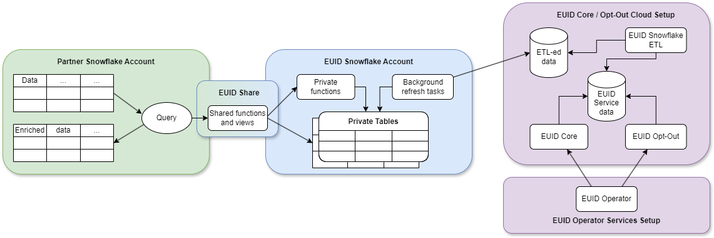

import Link from '@docusaurus/Link';

# Snowflake Integration Guide

[Snowflake](https://www.snowflake.com/) is a cloud data warehousing solution, where you as a partner can store your data and integrate with the EUID framework. Using Snowflake, EUID enables you to securely share consumer identifier data without exposing sensitive <Link href="../ref-info/glossary-uid#gl-personal-data">personal data</Link>. Even though you have the option to query the Operator Web Services directly for the consumer identifier data, the Snowflake EUID integration offers a more seamless experience.

:::important
This document is for those using the latest [Snowflake marketplace listing](#snowflake-marketplace-listing). If you're using an earlier version, see [Snowflake Integration Guide (Pre-July 2025)](integration-snowflake-previous.md). If you're using the earlier implementation, we recommend that you migrate to the newer version to take advantage of the updates and enhancements: for details, see [Changes from Previous Version](#changes-from-previous-version). For migration information, see [Migration Guide](#migration-guide).
:::

## Snowflake Marketplace Listing

The following listing for EUID is available on the Snowflake Marketplace:
- [European Unified ID Advertiser and Data Provider Identity Solution](https://app.snowflake.com/marketplace/listing/GZTDZJ7404/european-unified-id-european-unified-id-advertiser-and-data-provider-identity-solution)

:::tip
For a summary of all integration options and steps for advertisers and data providers, see [Advertiser/Data Provider Integration Overview](integration-advertiser-dataprovider-overview.md).
:::

## Functionality

The following table summarizes the functionality available with the EUID Snowflake integration.

| Encrypt Raw EUID to EUID Token | Decrypt EUID Token to Raw EUID | Generate EUID Token from Personal Data | Refresh EUID Token | Map Personal Data to Raw EUID |
| :--- | :--- | :--- | :--- | :--- |
| &#8212; | &#8212; | &#8212; | &#8212;* | &#9989; |

*You cannot use Snowflake to generate an EUID token directly from personal data. However, you can convert personal data to a raw EUID, and then encrypt the raw EUID into an EUID token.


## Changes from Previous Version

The July 2025 update to the EUID Snowflake Marketplace integration introduces a new identity mapping function that simplifies EUID refresh management and allows accessing previous raw EUIDs for 90 days after rotation.

:::note
These changes assume that your code integration uses the version of Snowflake functions published before July 2025: see [Snowflake Integration Guide (Pre-July 2025)](integration-snowflake-previous.md). For details on migrating to this version, see [Migration Guide](#migration-guide).
:::

The following table shows the differences between the old and new identity mapping functions.

| Function | Version | Return Fields | Key Differences | Comments |
| :-- | :-- | :-- | :-- | :-- |
| `FN_T_IDENTITY_MAP` | Previous | `UID`, `BUCKET_ID`, `UNMAPPED` | Basic identity mapping with salt bucket tracking | Legacy function using salt bucket monitoring for refresh management. For details, see [Snowflake Integration Guide (Pre-July 2025)](integration-snowflake-previous.md).|
| `FN_T_IDENTITY_MAP_V3` | Current | `UID`, `PREV_UID`, `REFRESH_FROM`, `UNMAPPED` | Enhanced with previous EUID access and refresh timestamps | Returns previous EUID for 90 days after rotation and uses refresh timestamps instead of salt bucket monitoring. For details, see [Map Personal Data](#map-personal-data).|

### Key Benefits

This update provides two major benefits:

- **Simplified Refresh Management**: You can monitor for EUIDs reaching `REFRESH_FROM` timestamps instead of polling <Link href="../ref-info/glossary-uid#gl-salt-bucket-id">salt buckets</Link> for rotation.
- **Previous EUID Access**: You have access to previous raw EUIDs for 90 days after rotation for campaign measurement.

## Workflow Diagram

The following diagram and table illustrate the different parts of the EUID integration process in Snowflake, and the workflow.



| Partner Snowflake Account | EUID Snowflake Account | EUID Core Opt-Out Cloud Setup |
| :--- | :--- | :--- |
|As a partner, you set up a Snowflake account to host your data and engage in EUID integration by consuming functions and views through the EUID Share. | EUID integration, hosted in a Snowflake account, grants you access to authorized functions and views that draw data from private tables. You can't access the private tables. The EUID Share reveals only essential data needed for you to perform EUID-related tasks.<br/>**NOTE**: We store <Link href="../ref-info/glossary-uid#gl-salt">salts</Link> and encryption keys in the private tables. No <Link href="../ref-info/glossary-uid#gl-personal-data">personal data</Link> is stored at any point. |ETL (Extract Transform Load) jobs constantly update the EUID Core/Optout Snowflake storage with internal data that powers the EUID Operator Web Services. The data used by the Operator Web Services is also available through the EUID Share. |
|When you use shared functions and views, you pay Snowflake for transactional computation costs. |These private tables, secured in the EUID Snowflake account, automatically synchronize with the EUID Core/Optout Snowflake storage that holds internal data used to complete EUID-related tasks. | |

## Summary of Integration Steps

:::important
To be able to request data, you must use the `ACCOUNTADMIN` role or another role with the `CREATE DATABASE` and `IMPORT SHARE` privileges in your Snowflake account.
:::

The following list summarizes the integration steps for EUID mapping in Snowflake in the production environment:

:::note
If you want to try out an integration before using the production environment, see [Testing in the Integ Environment](#testing-in-the-integ-environment).
:::

1. Make sure that the EUID POC paperwork is signed with your EUID contact. If you're not sure who to ask, see [Contact Info](../getting-started/gs-account-setup.md#contact-info).

1. Request access to the EUID share:

   - Request access through the [Snowflake Marketplace Listing](#snowflake-marketplace-listing). In your request, include your Snowflake account number and the region.

   - Let your EUID contact know that you've requested access.

1. Your EUID contact arranges for your Snowflake account to be provisioned with access to the EUID mapping share.

:::note
If you did any initial testing (see [Testing in the Integ Environment](#testing-in-the-integ-environment)), be sure to update the functions to reflect the production EUID share, along with your own relevant table names. 
:::

## Testing in the Integ Environment

If you'd like to test the mapping share before signing an EUID POC, you can ask your EUID contact for access to the Snowflake share in the integ (integration) environment. This environment is for testing only, and has no production data. In the request, be sure to include your account number and region.

In this scenario, the following steps occur:

1. Your EUID contact provisions the share listing in the Snowflake Private Marketplace, and lets you know when this step is complete.

2. You can then view the Private Marketplace listing and request access to the integ share.

3. When you've requested access, your EUID contact provisions the integ share to your account.

## Shared Objects

You can map personal data to EUIDs by using the following function:

- `FN_T_IDENTITY_MAP_V3` (for details, see [Map Personal Data](#map-personal-data))

The following function is deprecated in favor of `FN_T_IDENTITY_MAP_V3`. You can still use it if you are on the previous Snowflake version (see [Snowflake Integration Guide (Pre-July 2025)](integration-snowflake-previous.md)), but we recommend upgrading as soon as possible:

- `FN_T_IDENTITY_MAP` (deprecated)

:::note
If you are using the deprecated function, and need help migrating to the newer function, see [Migration Guide](#migration-guide).
:::

To identify the EUIDs that you must regenerate, monitor the `REFRESH_FROM` timestamps returned by the `FN_T_IDENTITY_MAP_V3` function. For details, see [Monitor Raw EUID Refresh and Regenerate Raw EUIDs](#monitor-raw-euid-refresh-and-regenerate-raw-euids).


### Database and Schema Names

The following sections include query examples for each solution, which are identical except for the database and schema name variables:

```
{DATABASE_NAME}.{SCHEMA_NAME}
```

For example:

```sql
select UID, PREV_UID, REFRESH_FROM, UNMAPPED from table({DATABASE_NAME}.{SCHEMA_NAME}.FN_T_IDENTITY_MAP_V3('validate@example.com', 'email'));
```

All query examples use the following default values for each name variable:

| Variable          | Default Value      | Comments                                                                                                                                  |
|:------------------|:-------------------|:------------------------------------------------------------------------------------------------------------------------------------------|
| `{DATABASE_NAME}` | `EUID_PROD_UID_SH` | If needed, you can change the default database name when creating a new database after you are granted access to the selected EUID Share. |
| `{SCHEMA_NAME}`   | `UID`              | This is an immutable name.    

### Map Personal Data

To map all types of <Link href="../ref-info/glossary-uid#gl-personal-data">personal data</Link>, use the `FN_T_IDENTITY_MAP_V3` function.

If the personal data is an email address, the service normalizes the data using the EUID [Email Address Normalization](../getting-started/gs-normalization-encoding.md#email-address-normalization) rules.

If the personal data is a phone number, you must normalize it before sending it to the service, using the EUID [Phone Number Normalization](../getting-started/gs-normalization-encoding.md#phone-number-normalization) rules.

| Argument     | Data Type    | Description                                                                                 |
|:-------------|:-------------|:--------------------------------------------------------------------------------------------|
| `INPUT`      | varchar(256) | The personal data to map to the EUID, refresh timestamp and previous EUID for 90 days after rotation. |
| `INPUT_TYPE` | varchar(256) | The type of personal data to map. Allowed values: `email`, `email_hash`, `phone`, and `phone_hash`.   |

A successful query returns the following information for the specified personal data.

| Column Name    | Data Type | Description                                                                                                                                                                                                                                                                                                                       |
|:---------------|:----------|:----------------------------------------------------------------------------------------------------------------------------------------------------------------------------------------------------------------------------------------------------------------------------------------------------------------------------------|
| `UID`          | TEXT      | The value is one of the following:<ul><li>Personal data was successfully mapped: The EUID associated with the personal data.</li><li>Otherwise: `NULL`.</li></ul>                                                                                                                                                               |
| `PREV_UID`     | TEXT      | The value is one of the following:<ul><li>Personal data was successfully mapped and the current raw EUID was rotated in the last 90 days: the previous raw EUID.</li><li>Otherwise: `NULL`.</li></ul>                                             |
| `REFRESH_FROM` | TIMESTAMP | The value is one of the following:<ul><li>Personal data was successfully mapped: The timestamp (in epoch seconds) indicating when this EUID should be refreshed.</li><li>Otherwise: `NULL`.</li></ul>                                                                                                               |
| `UNMAPPED`     | TEXT      | The value is one of the following:<ul><li>Personal data was successfully mapped: `NULL`.</li><li>Otherwise: The reason why the identifier was not mapped: `OPTOUT`, `INVALID IDENTIFIER`, or `INVALID INPUT TYPE`.<br/>For details, see [Values for the UNMAPPED Column](#values-for-the-unmapped-column).</li></ul> |

#### Values for the UNMAPPED Column

The following table shows possible values for the `UNMAPPED` column.

| Value | Meaning |
| :-- | :-- |
| `NULL` | The personal data was successfully mapped. |
| `OPTOUT` | The user has opted out. |
| `INVALID IDENTIFIER` | The email address or phone number is invalid. |
| `INVALID INPUT TYPE` | The value of `INPUT_TYPE` is invalid. Valid values for INPUT_TYPE are: `email`, `email_hash`, `phone`, `phone_hash`. |

#### Examples

Mapping request examples in this section:

- [Single Unhashed Email](#mapping-request-example---single-unhashed-email)
- [Multiple Unhashed Emails](#mapping-request-example---multiple-unhashed-emails)
- [Single Unhashed Phone Number](#mapping-request-example---single-unhashed-phone-number)
- [Multiple Unhashed Phone Numbers](#mapping-request-example---multiple-unhashed-phone-numbers)
- [Single Hashed Email](#mapping-request-example---single-hashed-email)
- [Multiple Hashed Emails](#mapping-request-example---multiple-hashed-emails)
- [Single Hashed Phone Number](#mapping-request-example---single-hashed-phone-number)
- [Multiple Hashed Phone Numbers](#mapping-request-example---multiple-hashed-phone-numbers)

:::note
The input and output data in these examples is fictitious, for illustrative purposes only. The values provided are not real values.
:::

#### Mapping Request Example - Single Unhashed Email

The following query illustrates how to map a single email address, using the [default database and schema names](#database-and-schema-names).

```sql
select UID, PREV_UID, REFRESH_FROM, UNMAPPED from table(EUID_PROD_UID_SH.UID.FN_T_IDENTITY_MAP_V3('validate@example.com', 'email'));
```

Query results for a single email:

```
+----------------------------------------------+--------------------------------------------------+--------------+----------+
| UID                                          | PREV_UID                                         | REFRESH_FROM | UNMAPPED |
+----------------------------------------------+--------------------------------------------------+--------------+----------+
| 2ODl112/VS3x2vL+kG1439nPb7XNngLvOWiZGaMhdcU= | vP9zK2mL7fR4tY8qN3wE6xB0dH5jA1sC+nI/oGuMeVa=     | 1735689600   | NULL     |
+----------------------------------------------+--------------------------------------------------+--------------+----------+
```

#### Mapping Request Example - Multiple Unhashed Emails

The following query illustrates how to map multiple email addresses, using the [default database and schema names](#database-and-schema-names).

```sql
select a.ID, a.EMAIL, m.UID, m.PREV_UID, m.REFRESH_FROM, m.UNMAPPED from AUDIENCE a LEFT JOIN(
    select ID, t.* from AUDIENCE, lateral EUID_PROD_UID_SH.UID.FN_T_IDENTITY_MAP_V3(EMAIL, 'email') t) m
    on a.ID=m.ID;
```

Query results for multiple emails:

The following table identifies each item in the response, including `NULL` values for `NULL` or improperly formatted emails.

```
+----+----------------------+----------------------------------------------+----------------------------------------------+--------------+--------------------+
| ID | EMAIL                | UID                                          | PREV_UID                                     | REFRESH_FROM | UNMAPPED           |
+----+----------------------+----------------------------------------------+----------------------------------------------+--------------+--------------------+
|  1 | validate@example.com | 2ODl112/VS3x2vL+kG1439nPb7XNngLvOWiZGaMhdcU= | vP9zK2mL7fR4tY8qN3wE6xB0dH5jA1sC+nI/oGuMeVa= | 1735689600   | NULL               |
|  2 | test@uidapi.com      | IbW4n6LIvtDj/8fCESlU0QG9K/fH63UdcTkJpAG8fIQ= | NULL                                         | 1735689600   | NULL               |
|  3 | optout@example.com   | NULL                                         | NULL                                         | NULL         | OPTOUT             |
|  4 | invalid-email        | NULL                                         | NULL                                         | NULL         | INVALID IDENTIFIER |
|  5 | NULL                 | NULL                                         | NULL                                         | NULL         | INVALID IDENTIFIER |
+----+----------------------+----------------------------------------------+----------------------------------------------+--------------+--------------------+
```

#### Mapping Request Example - Single Unhashed Phone Number

The following query illustrates how to map a phone number, using the [default database and schema names](#database-and-schema-names).

You must normalize phone numbers using the EUID [Phone Number Normalization](../getting-started/gs-normalization-encoding.md#phone-number-normalization) rules.

```sql
select UID, PREV_UID, REFRESH_FROM, UNMAPPED from table(EUID_PROD_UID_SH.UID.FN_T_IDENTITY_MAP_V3('+12345678901', 'phone'));
```

Query results for a single phone number:

```
+----------------------------------------------+----------+--------------+----------+
| UID                                          | PREV_UID | REFRESH_FROM | UNMAPPED |
+----------------------------------------------+----------+--------------+----------+
| 2ODl112/VS3x2vL+kG1439nPb7XNngLvOWiZGaMhdcU= | NULL     | 1735689600   | NULL     |
+----------------------------------------------+----------+--------------+----------+
```

#### Mapping Request Example - Multiple Unhashed Phone Numbers

The following query illustrates how to map multiple phone numbers, using the [default database and schema names](#database-and-schema-names).

You must normalize phone numbers using the EUID [Phone Number Normalization](../getting-started/gs-normalization-encoding.md#phone-number-normalization) rules.

```sql
select a.ID, a.PHONE, m.UID, m.PREV_UID, m.REFRESH_FROM, m.UNMAPPED from AUDIENCE a LEFT JOIN(
    select ID, t.* from AUDIENCE, lateral EUID_PROD_UID_SH.UID.FN_T_IDENTITY_MAP_V3(PHONE, 'phone') t) m
    on a.ID=m.ID;
```

Query results for multiple phone numbers:

The following table identifies each item in the response, including `NULL` values for `NULL` or invalid phone numbers.

```
+----+--------------+----------------------------------------------+----------------------------------------------+--------------+--------------------+
| ID | PHONE        | UID                                          | PREV_UID                                     | REFRESH_FROM | UNMAPPED           |
+----+--------------+----------------------------------------------+----------------------------------------------+--------------+--------------------+
|  1 | +12345678901 | 2ODl112/VS3x2vL+kG1439nPb7XNngLvOWiZGaMhdcU= | vP9zK2mL7fR4tY8qN3wE6xB0dH5jA1sC+nI/oGuMeVa= | 1735689600   | NULL               |
|  2 | +61491570006 | IbW4n6LIvtDj/8fCESlU0QG9K/fH63UdcTkJpAG8fIQ= | NULL                                         | 1735689600   | NULL               |
|  3 | +56789123001 | NULL                                         | NULL                                         | NULL         | OPTOUT             |
|  4 | 1234         | NULL                                         | NULL                                         | NULL         | INVALID IDENTIFIER |
|  5 | NULL         | NULL                                         | NULL                                         | NULL         | INVALID IDENTIFIER |
+----+--------------+----------------------------------------------+----------------------------------------------+--------------+--------------------+
```

#### Mapping Request Example - Single Hashed Email

The following query illustrates how to map a single email address hash, using the [default database and schema names](#database-and-schema-names).

```sql
select UID, PREV_UID, REFRESH_FROM, UNMAPPED from table(EUID_PROD_UID_SH.UID.FN_T_IDENTITY_MAP_V3(BASE64_ENCODE(SHA2_BINARY('validate@example.com', 256)), 'email_hash'));
```

Query results for a single hashed email:

```
+----------------------------------------------+----------------------------------------------+--------------+----------+
| UID                                          | PREV_UID                                     | REFRESH_FROM | UNMAPPED |
+----------------------------------------------+----------------------------------------------+--------------+----------+
| 2ODl112/VS3x2vL+kG1439nPb7XNngLvOWiZGaMhdcU= | vP9zK2mL7fR4tY8qN3wE6xB0dH5jA1sC+nI/oGuMeVa= | 1735689600   | NULL     |
+----------------------------------------------+----------------------------------------------+--------------+----------+
```

#### Mapping Request Example - Multiple Hashed Emails

The following query illustrates how to map multiple email address hashes, using the [default database and schema names](#database-and-schema-names).

```sql
select a.ID, a.EMAIL_HASH, m.UID, m.PREV_UID, m.REFRESH_FROM, m.UNMAPPED from AUDIENCE a LEFT JOIN(
    select ID, t.* from AUDIENCE, lateral EUID_PROD_UID_SH.UID.FN_T_IDENTITY_MAP_V3(EMAIL_HASH, 'email_hash') t) m
    on a.ID=m.ID;
```

Query results for multiple hashed emails:

The following table identifies each item in the response, including `NULL` values for `NULL` hashes.

```
+----+----------------------------------------------+----------------------------------------------+----------------------------------------------+--------------+--------------------+
| ID | EMAIL_HASH                                   | UID                                          | PREV_UID                                     | REFRESH_FROM | UNMAPPED           |
+----+----------------------------------------------+----------------------------------------------+----------------------------------------------+--------------+--------------------+
|  1 | LdhtUlMQ58ZZy5YUqGPRQw5xUMS5dXG5ocJHYJHbAKI= | 2ODl112/VS3x2vL+kG1439nPb7XNngLvOWiZGaMhdcU= | vP9zK2mL7fR4tY8qN3wE6xB0dH5jA1sC+nI/oGuMeVa= | 1735689600   | NULL               |
|  2 | /XJSTajB68SCUyuc3ePyxSLNhxrMKvJcjndq8TuwW5g= | IbW4n6LIvtDj/8fCESlU0QG9K/fH63UdcTkJpAG8fIQ= | NULL                                         | 1735689600   | NULL               |
|  2 | UebesrNN0bQkm/QR7Jx7eav+UDXN5Gbq3zs1fLBMRy0= | NULL                                         | NULL                                         | 1735689600   | OPTOUT             |
|  4 | NULL                                         | NULL                                         | NULL                                         | NULL         | INVALID IDENTIFIER |
+----+----------------------------------------------+----------------------------------------------+----------------------------------------------+--------------+--------------------+
```

#### Mapping Request Example - Single Hashed Phone Number

The following query illustrates how to map a single phone number hash, using the [default database and schema names](#database-and-schema-names).

```sql
select UID, PREV_UID, REFRESH_FROM, UNMAPPED from table(EUID_PROD_UID_SH.UID.FN_T_IDENTITY_MAP_V3(BASE64_ENCODE(SHA2_BINARY('+12345678901', 256)), 'phone_hash'));
```

Query results for a single hashed phone number:

```
+----------------------------------------------+----------------------------------------------+--------------+----------+
| UID                                          | PREV_UID                                     | REFRESH_FROM | UNMAPPED |
+----------------------------------------------+----------------------------------------------+--------------+----------+
| 2ODl112/VS3x2vL+kG1439nPb7XNngLvOWiZGaMhdcU= | vP9zK2mL7fR4tY8qN3wE6xB0dH5jA1sC+nI/oGuMeVa= | 1735689600   | NULL     |
+----------------------------------------------+----------------------------------------------+--------------+----------+
```

#### Mapping Request Example - Multiple Hashed Phone Numbers

The following query illustrates how to map multiple phone number hashes, using the [default database and schema names](#database-and-schema-names).

```sql
select a.ID, a.PHONE_HASH, m.UID, m.PREV_UID, m.REFRESH_FROM, m.UNMAPPED from AUDIENCE a LEFT JOIN(
    select ID, t.* from AUDIENCE, lateral EUID_PROD_UID_SH.UID.FN_T_IDENTITY_MAP_V3(PHONE_HASH, 'phone_hash') t) m
    on a.ID=m.ID;
```

Query results for multiple hashed phone numbers:

The following table identifies each item in the response, including `NULL` values for `NULL` hashes.

```
+----+----------------------------------------------+----------------------------------------------+----------------------------------------------+--------------+--------------------+
| ID | PHONE_HASH                                   | UID                                          | PREV_UID                                     | REFRESH_FROM | UNMAPPED           |
+----+----------------------------------------------+----------------------------------------------+----------------------------------------------+--------------+--------------------+
|  1 | LdhtUlMQ58ZZy5YUqGPRQw5xUMS5dXG5ocJHYJHbAKI= | 2ODl112/VS3x2vL+kG1439nPb7XNngLvOWiZGaMhdcU= | vP9zK2mL7fR4tY8qN3wE6xB0dH5jA1sC+nI/oGuMeVa= | 1735689600   | NULL               |
|  2 | /XJSTajB68SCUyuc3ePyxSLNhxrMKvJcjndq8TuwW5g= | IbW4n6LIvtDj/8fCESlU0QG9K/fH63UdcTkJpAG8fIQ= | NULL                                         | 1735689600   | NULL               |
|  2 | UebesrNN0bQkm/QR7Jx7eav+UDXN5Gbq3zs1fLBMRy0= | NULL                                         | NULL                                         | 1735689600   | OPTOUT             |
|  4 | NULL                                         | NULL                                         | NULL                                         | NULL         | INVALID IDENTIFIER |
+----+----------------------------------------------+----------------------------------------------+----------------------------------------------+--------------+--------------------+
```

### Monitor Raw EUID Refresh and Regenerate Raw EUIDs

The `FN_T_IDENTITY_MAP_V3` function returns refresh timestamps (`REFRESH_FROM`) that indicate when each EUID should be refreshed.

To determine which EUIDs need regeneration, compare the current time to the `REFRESH_FROM` timestamps returned by the function.

| Column Name       | Data Type     | Description                                                                                                                                                                                                               |
|:------------------|:--------------|:--------------------------------------------------------------------------------------------------------------------------------------------------------------------------------------------------------------------------|
| `UID`             | TEXT          | The EUID associated with the personal data. This is the current EUID value returned by the identity mapping function.                                                                                                              |
| `REFRESH_FROM`    | TIMESTAMP     | The timestamp (in epoch seconds) indicating when this EUID should be refreshed. Compare this value to the current time to determine if regeneration is needed.                                                         |

The following example shows an input table and the query used to find the EUIDs in the table that must be regenerated because their refresh time has been reached.

#### Targeted Input Table

In this example scenario, the advertiser/data provider has stored the EUIDs in a table named `AUDIENCE_WITH_EUID`. The `REFRESH_FROM` column contains the timestamp when each EUID should be refreshed. If no EUID has been generated, the value is `NULL`, as shown in the third example. The advertiser/data provider can compare these timestamps to the current time to determine which EUIDs need to be regenerated.

```sql
select * from AUDIENCE_WITH_EUID;
```
```
+----+----------------------+----------------------------------------------+--------------+
| ID | EMAIL                | EUID                                         | REFRESH_FROM |
+----+----------------------+----------------------------------------------+--------------+
|  1 | validate@example.com | 2ODl112/VS3x2vL+kG1439nPb7XNngLvOWiZGaMhdcU= | 1735689600   |
|  2 | test1@uidapi.com     | Q4A5ZBuBCYfuV3Wd8Fdsx2+i33v7jyFcQbcMG/LH4eM= | 1735776000   |
|  3 | test2@uidapi.com     | NULL                                         | NULL         |
+----+----------------------+----------------------------------------------+--------------+
```

To find missing or outdated EUIDs, use the following query example.

```sql
select * from AUDIENCE_WITH_EUID
  where REFRESH_FROM <= DATE_PART(epoch_second, CURRENT_TIMESTAMP()) or EUID IS NULL;
```

Query results:

The following table identifies each item in the response. The result includes EUIDs that need to be refreshed because their `REFRESH_FROM` timestamp has passed, or EUIDs that are missing. ID 1 is returned because its refresh time (1735689600) is in the past (assuming current time is later). ID 2 is not returned because its refresh time hasn't been reached yet. ID 3 is returned due to a missing EUID.

```
+----+----------------------+----------------------------------------------+--------------+
| ID | EMAIL                | EUID                                         | REFRESH_FROM |
+----+----------------------+----------------------------------------------+--------------+
|  1 | validate@example.com | 2ODl112/VS3x2vL+kG1439nPb7XNngLvOWiZGaMhdcU= | 1735689600   |
|  3 | test2@uidapi.com     | NULL                                         | NULL         |
+----+----------------------+----------------------------------------------+--------------+
```


## Migration Guide

This section provides information to help you upgrade from the previous version to the new EUID Snowflake functionality with v3 functions.


### Changing Existing Code

For a summary of changes, see [Changes from Previous Version](#changes-from-previous-version). The code snippets in this section are before/after examples of how the earlier functions might be implemented, and how you could update to use the new function. The key change is migrating from `FN_T_IDENTITY_MAP` to `FN_T_IDENTITY_MAP_V3`, which provides refresh timestamps instead of salt bucket IDs and includes previous EUID access.

#### Example for Mapping Unhashed Emails

Before:

```sql
select UID, BUCKET_ID, UNMAPPED from table({DATABASE_NAME}.{SCHEMA_NAME}.FN_T_IDENTITY_MAP(EMAIL, 'email'));
```

After:

```sql
select UID, PREV_UID, REFRESH_FROM, UNMAPPED from table({DATABASE_NAME}.{SCHEMA_NAME}.FN_T_IDENTITY_MAP_V3(EMAIL, 'email'));
```

#### Example for Mapping Unhashed Phone Numbers

Before:

```sql
select UID, BUCKET_ID, UNMAPPED from table({DATABASE_NAME}.{SCHEMA_NAME}.FN_T_IDENTITY_MAP(PHONE_NUMBER, 'phone'));
```

After:

```sql
select UID, PREV_UID, REFRESH_FROM, UNMAPPED from table({DATABASE_NAME}.{SCHEMA_NAME}.FN_T_IDENTITY_MAP_V3(PHONE_NUMBER, 'phone'));
```

#### Example for Monitoring EUID Refresh and Regenerating Raw EUIDs

The v3 function provides refresh timestamps directly, eliminating the need to monitor salt buckets. Instead of joining with salt bucket views, you can compare the current timestamp against the `REFRESH_FROM` timestamp returned by the function.

Before (using salt bucket monitoring):

```sql
select a.*, b.LAST_SALT_UPDATE_UTC
  from AUDIENCE_WITH_EUID a LEFT OUTER JOIN {DATABASE_NAME}.{SCHEMA_NAME}.SALT_BUCKETS b
  on a.BUCKET_ID=b.BUCKET_ID
  where a.LAST_EUID_UPDATE_UTC < b.LAST_SALT_UPDATE_UTC or a.EUID IS NULL;
```

After (using refresh timestamp monitoring):

```sql
select * from AUDIENCE_WITH_EUID
  where REFRESH_FROM <= DATE_PART(epoch_second, CURRENT_TIMESTAMP()) or EUID IS NULL;
```

<!-- uid2_euid_diff when updating this file: EUID > UID2, DII > personal data, EUID no sharing. In code: placeholders updated: UID2_BASE_URL, UID2_API_KEY, UID2_SECRET_KEY, all to EUID. Also table name AUDIENCE_WITH_UID2 > AUDIENCE_WITH_EUID. UID2_PROD_UID_SH > EUID_PROD_UID_SH.  -->
