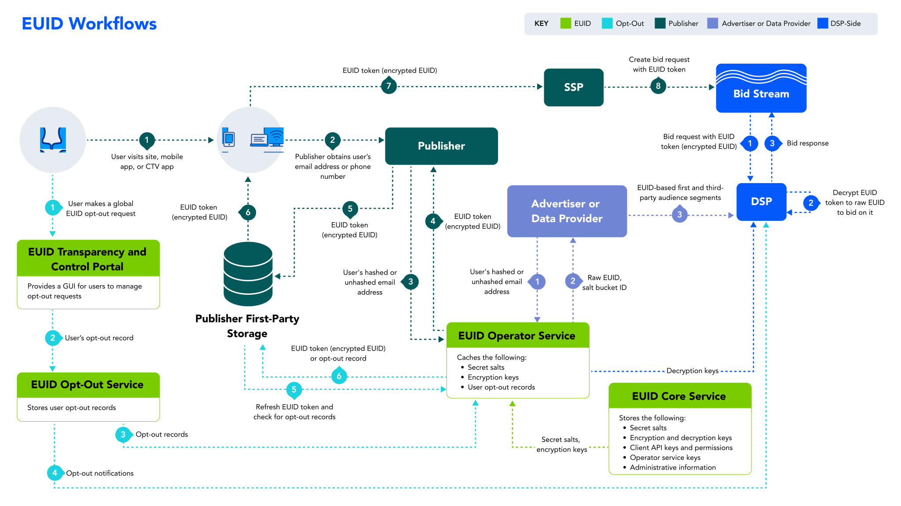

import Link from '@docusaurus/Link';

# European Unified ID Overview

The European Unified ID (EUID) is a framework that enables deterministic identity for advertising opportunities on the open internet for many [participants](#participants) across the advertising ecosystem. The EUID framework enables publisher websites, mobile apps, and Connected TV (CTV) apps to monetize through programmatic workflows. Built on the [UID2 framework](https://unifiedid.com/docs/intro), EUID offers privacy controls designed to help participants meet market requirements in many European countries and some other regions such as the UK.

:::note
The term "EUID" can refer to either the framework or an actual identifier. Unless otherwise indicated, this page provides an overview of the EUID framework.
:::

### EUID vs. UID2

EUID is an open-source, standalone solution with its own unique namespace that builds on the [UID2 framework](https://unifiedid.com/docs/intro). The main differences between UID2 and EUID result from more stringent European and UK data protection laws relating to consent practices, rights for data subjects, and obligations between participants. Otherwise, EUID follows the same [guiding principles](#guiding-principles) as UID2.

:::important
Even though it is built on the UID2 framework, EUID is a separate framework.
:::

The following table summarizes the key differences between the two frameworks.

| Comparison Aspect | UID2 | EUID |
| :--- | :--- | :--- |
| Open-sourced framework | Yes | Yes |
| Interoperability | Yes | Yes |
| Personal data used | Email addresses, phone numbers | Email addresses |
| Consent | Based on local regulations such as the California Privacy Rights Act (CPRA) and the California Consumer Privacy Act (CCPA). | Driven by the General Data Protection Regulation (GDPR), the Transparency and Consent Framework (TCF) operated by IAB, and local regulatory guidance. |

### Guiding Principles

The EUID framework has the following principles as its foundation:

- **First-party relationships**: EUID enables advertisers to activate their first-party data on publisher websites across the open internet.

- **Non-proprietary (universal) standard**: All [participants](#participants) in the advertising ecosystem who execute an appropriate participation agreement can access EUID.

- **Open source**: The source code for the EUID [components](#components) is publicly available.

- **Interoperable**: The framework allows other identity solutions (commercial and proprietary) to integrate and provide EUID tokens with their offerings.

- **Secure and encrypted data**: EUID leverages multiple layers of security to protect user and other participant data.

- **Consumer control**: Consumers can opt out of EUID at any time through the [Transparency and Control Portal](https://transparentadvertising.eu).

### Technical Design Principles

The EUID framework is built on the following technical principles:

- **Distributed integration**: Multiple certified integration paths provide options for publishers, advertisers, and third-party data providers to manage and exchange EUID tokens.

- **Decentralized storage**: The framework does not have centralized storage for personal data mappings. All participants maintain only their own data.

- **Lean infrastructure**: The EUID system is light and inexpensive to operate.

- **Internet scale**: The EUID infrastructure can scale to address the continuously increasing needs of [participants](#participants) and to meet performance demands of specific geographic regions.

- **Self-reliant**: EUID does not rely on external services for the processing of real-time bidding (RTB) data.

## Elements of the EUID Infrastructure

The following sections explain and illustrate the key elements of the EUID infrastructure:

  - [EUID Identifier Types](#euid-identifier-types)
  - [Components](#components)
  - [Participants](#participants)
  - [Workflows](#workflows)

### EUID Identifier Types

EUID is a deterministic ID that is based on email addresses. There are two types of EUIDs: raw EUIDs and EUID tokens (also known as advertising tokens). The following table explains each type.

| ID Type | Shared in Bidstream? | Description |
| :--- | :--- | :--- |
| **Raw EUIDs** | No | An unencrypted alphanumeric identifier created through the EUID APIs or SDKs with the user's email address as input. To avoid revealing the source data, the input value is hashed if it was not already hashed, then salted, and then hashed again using a secret <Link href="../ref-info/glossary-uid#gl-salt">salt</Link> value to create the raw EUID. The process that creates the raw EUID is designed to create a secure, opaque value that can be stored by advertisers, third-party data providers, and demand-side platforms (DSPs). |
| **EUID Token (Advertising Token)** | Yes | An encrypted form of a raw EUID. EUID tokens are generated from hashed or unhashed email addresses that are converted to raw EUIDs and then encrypted to help ensure protection in the <Link href="ref-info/glossary-uid#gl-bidstream">bidstream</Link>. EUID tokens are designed to be used by publishers or publisher service providers. Supply-side platforms (SSPs) pass EUID tokens in the bidstream and DSPs decrypt them at bid request time. |

### Components

The EUID framework consists of the following components, all of which are currently managed by The Trade Desk.

| Component | Description |
| :--- | :--- |
| **Core Service** | A centralized service that manages access to <a href="ref-info/glossary-uid#gl-salt">salts</a>, <a href="ref-info/glossary-uid#gl-encryption-key">encryption keys</a>, and other relevant data in the EUID ecosystem. |
| **Operator Service** | A service that enables the management and storage of encryption keys and salts from the EUID Core Service, hashing of users' personal data, encryption of raw EUIDs, and decryption of EUID tokens. There can be multiple instances of the service (public or private) operated by multiple [participants](#participants), known as operators. Open operators run publicly available instances of the Operator Service and make them available to all relevant EUID participants. There might also be private operators that run private instances of the Operator Service exclusively for their own use. All instances are designed with protections to keep critical EUID data secure and interoperable, regardless of who operates the service. |
| **Opt-Out Service** | A global service that manages and stores user opt-out requests and disseminates them to publishers, operator service instances, and DSPs. |
| **Transparency and Control Portal** | A user-facing website, [https://transparentadvertising.eu](https://transparentadvertising.eu), that allows consumers to opt out of EUID at any time. |

### Participants 

With its transparent and interoperable approach, EUID provides a collaborative framework for many participants across the advertising ecosystem—advertisers, publishers, DSPs, SSPs, single sign-on (SSO) providers, customer data platforms (CDPs), consent management providers (CMPs), identity providers, third-party data providers, and measurement providers.

The following table lists the key participants and their roles in the EUID [workflows](#workflows).

| Participant | Role Description |
| :--- | :--- |
| **Core Administrator** | An organization (currently, The Trade Desk) that manages the EUID Core Service and other [components](#components). For example, it distributes encryption keys and salts to EUID operators and sends user opt-out requests to operators and DSPs. |
| **Operators** | Organizations that operate the Operator Service (via the EUID APIs). Operators receive and store encryption keys and salts from the EUID Core Service, salt and hash personal data to return EUID tokens, encrypt raw EUIDs to generate EUID tokens, and distribute EUID token decryption keys. Open operators run public instances of the Operator Service. For example, The Trade Desk currently serves as an open operator for the EUID framework, available to all participants. If other open operators are available, a participant can choose which operator to work with. Any participant can also choose to become a private operator to generate and manage EUIDs. |
| **DSPs** | DSPs integrate with the EUID system to receive EUIDs from advertisers (as first-party data) and third-party data providers (as third-party data) and leverage them to inform bidding on EUIDs in the bidstream. |
| **Data Providers** | Organizations that collect user data and push it to other EUID participants&#8212;for example, advertisers, identity graph providers, and third-party data providers. |
| **Advertisers** | Organizations that buy impressions across a range of publisher sites and use DSPs to decide which ad impressions to purchase and how much to bid on them. | 
| **Publishers** | Organizations that propagate EUID tokens to the bidstream via SSPs—for example, identity providers, publishers, and SSO providers. Publishers can choose to work with an SSO provider or an independent ID provider that is interoperable with EUID. Independent ID providers can handle the EUID integration on behalf of publishers. |
| **Consumers** | Users who have had an EUID token or raw EUID created from their email address. Consumers can opt out of EUID in the [EUID Transparency and Control Portal](https://transparentadvertising.eu). |

## Workflows

The following table lists four key workflows in the EUID system and provides links to the respective integration guides, which include specific diagrams, integration steps, FAQs, and other relevant information for each workflow.

| Workflow | Intended Primary Participants | Integration Guide |
| :--- | :--- | :--- |
| [Workflow for DSPs](overviews/overview-dsps.md#workflow-for-dsps) (Buy-Side) | DSPs who transact on EUID tokens in the bidstream. | See [DSP Integrations](guides/summary-guides#dsp-integrations) |
| [Workflow for Advertisers](overviews/overview-advertisers.md#workflow-for-advertisers) and [Workflow for Data Providers](overviews/overview-data-providers.md#workflow-for-data-providers) | Organizations that collect user data and push it to DSPs. | See [Advertiser/Data Provider Integrations](guides/summary-guides#advertiserdata-provider-integrations) |
| [Workflow for Publishers](overviews/overview-publishers.md#workflow-for-publishers) | Organizations that propagate EUID tokens to the bidstream via SSPs.  NOTE: Publishers can choose to integrate using Prebid, leverage the SDK for JavaScript, or complete their own server-side integration without using an SDK. | See [Publisher Integrations](guides/summary-guides#publisher-integrations) |
| [Opt-Out Workflow](getting-started/gs-opt-out.md#opt-out-workflow) | Consumers who engage with publishers or their SSO providers and other identity providers. | N/A |

The following diagram summarizes all four workflows. For each workflow, the [participants](#participants), [components](#components), [EUID identifier types](#euid-identifier-types), and numbered steps are color-coded.

## FAQs

See [Frequently Asked Questions](getting-started/gs-faqs.md).

## License
All work and artifacts are licensed under the [Apache License, Version 2.0](http://www.apache.org/licenses/LICENSE-2.0.txt).
