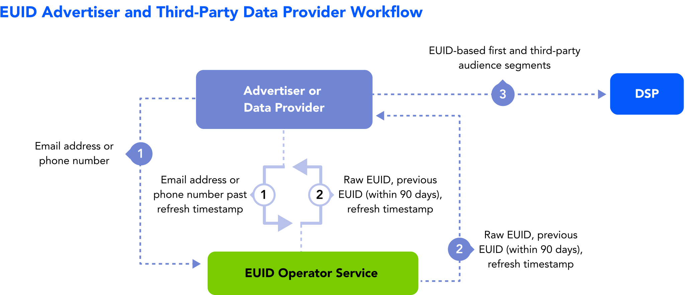

import Link from '@docusaurus/Link';

As an advertiser, you can upgrade your first-party data tactics with European Unified ID (EUID) to deliver omnichannel campaigns across devices with one identifier, for more durable identity strategies and better addressability.

Learn about benefits, workflow, documentation, and other resources for advertisers adopting EUID, as well as instructions for getting started.

## Benefits of EUID for Advertisers

Here are just some of the intended benefits of using EUID as part of your advertising strategy:
- Use a privacy-conscious form of CRM data in media-buying platforms.
- Simplify identity resolution at the household and individual level.
- Manage frequency and suppress audiences across channels and devices.
- Support identity use cases on Connected TV and on mobile apps where cookies don’t exist.
- Target and measure campaigns more holistically.
- Offer opt-out, with the goal of improving consumer privacy controls.

## Workflow for Advertisers

The following steps provide a high-level outline of the workflow intended for organizations that collect user data and push it to DSPs—for example, advertisers, identity graph providers, and third-party data providers.

The following process occurs in the background:
* The advertiser or data provider monitors the EUID Operator for rotated salt buckets and updates EUIDs as needed.

The following steps are an example of how an advertiser can integrate with EUID:

1. The advertiser sends a user’s <Link href="../ref-info/glossary-uid#gl-personal-data">personal data</Link> to the EUID Operator.
2. The EUID Operator generates and returns a raw EUID and salt bucket ID.
3. The advertiser stores the EUID and salt bucket ID and sends the EUID-based first-party and third-party audience segments to the DSP. 

   Server-side: The advertiser stores the EUID in a mapping table, DMP, data lake, or other server-side application.

## Getting Started

To get started, follow these steps:

1. Request access to EUID by filling out the form on the [Request Access](/request-access) page.

   Someone will contact you to discuss your needs and advise on appropriate next steps.
1. Decide on your [participant](../intro.md#participants) role or roles.
1. Decide which implementation option you want to use.
1. Receive your credentials (see [EUID Credentials](../getting-started/gs-credentials.md)) and follow the instructions in the implementation guide for the option you chose.

   :::note
   Be sure to encrypt request messages to EUID. For details, see [Encrypting Requests and Decrypting Responses](../getting-started/gs-encryption-decryption.md).
   :::
1. Test.
1. Go live.

## Implementation Resources

The following documentation resources are available for advertisers and data providers to implement EUID.

| Integration Type| Documentation | Content Description |
| :--- | :--- | :--- |
| Integration steps for organizations that collect user data and push it to other EUID participants | [Advertiser/Data Provider Integration Guide](../guides/advertiser-dataprovider-guide.md) | This guide covers integration workflows for mapping identity for audience-building and targeting. |

## FAQs for Advertisers

For a list of frequently asked questions for advertisers using the EUID framework, see [FAQs for Advertisers and Data Providers](../getting-started/gs-faqs.md#faqs-for-advertisers-and-data-providers).
