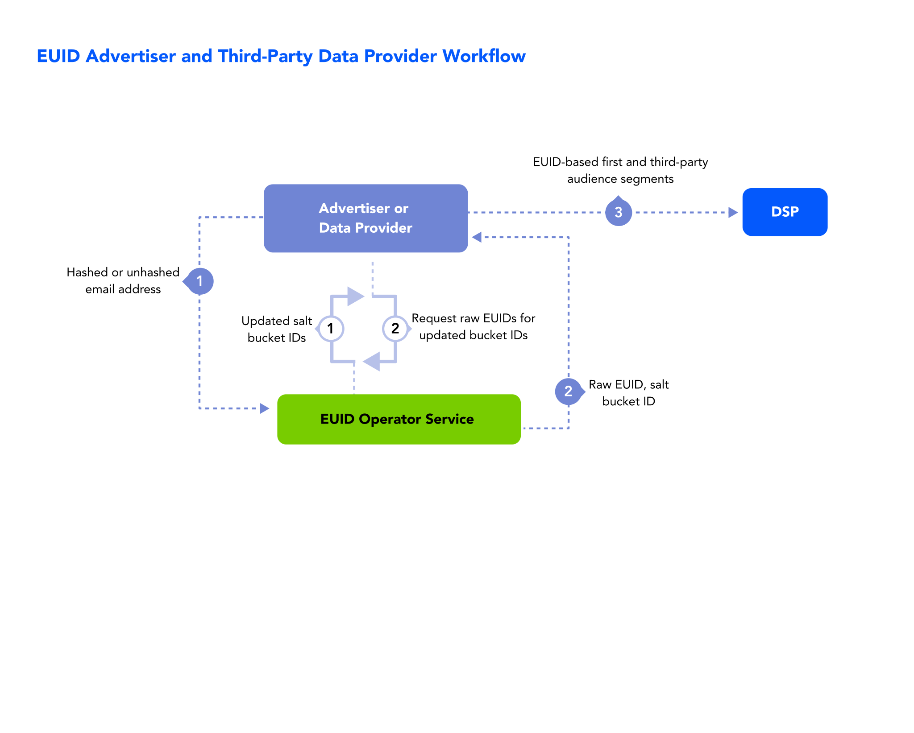

import Link from '@docusaurus/Link';

As a data and measurement provider, you can reduce identity fragmentation by adopting European Unified ID (EUID) to connect data with a more durable, omnichannel, and cross-device identifier to fulfil your customer use cases.

This solution is for you if you're offering data or related services for online or offline advertising, such as a provider of the following:
- Data onboarding
- Third-party audiences
- Identity resolution and graphs
- Measurement and attribution

Learn about the benefits, workflow, documentation, and other resources for data providers adopting EUID, as well as instructions for getting started.

## Benefits of EUID for data providers

Here are just some of the intended benefits available to you as a data provider using EUID. You can:
- Upgrade to a more privacy-conscious identifier that offers opt-out for consumer privacy control.
- Facilitate the use of a connective identity thread between platforms and channels for resolution, activation, and measurement.
- Aim to future-proof audience segments with deterministic IDs for advertisers.
- Connect online and offline data with a common ID to aim for more precision.
- More accurately measure campaigns with or without third-party cookies.

## Workflow for data providers

The following steps provide a high-level outline of the workflow intended for organizations that collect user data and push it to DSPs—for example, advertisers, identity graph providers, and third-party data providers.

The following process occurs in the background:
* The advertiser or data provider monitors <Link href="../ref-info/glossary-uid#gl-refresh-timestamp">refresh timestamps</Link> and updates EUIDs when the current time exceeds the refresh timestamp for each stored EUID.

The following steps are an example of how a data provider can integrate with EUID:

1. The data provider sends a user’s <Link href="../ref-info/glossary-uid#gl-personal-data">personal data</Link> to the EUID Operator.
2. The EUID Operator generates and returns a raw EUID and refresh timestamp.
3. The data provider stores the EUID and refresh timestamp and sends the EUID-based first-party and third-party audience segments to the DSP. 

   Server-side: The data provider stores the EUID and refresh timestamp in a mapping table, DMP, data lake, or other server-side application.

## Getting started

To get started, follow these steps:

1. Request access to EUID by filling out the form on the [Request access](/request-access) page.

   Someone will contact you to discuss your needs and advise on appropriate next steps.
1. Decide on your [participant](participants-overview.md#euid-external-participants) role or roles.
1. Decide which implementation option you want to use.
1. Receive your credentials (see [EUID credentials](../getting-started/gs-credentials.md)) and follow the instructions in the implementation guide for the option you chose.

   :::note
   Be sure to encrypt request messages to EUID. For details, see [Encrypting requests and decrypting responses](../getting-started/gs-encryption-decryption.md).
   :::
1. Test.
1. Go live.

## Implementation resources

The following documentation resources are available for advertisers and data providers to implement EUID.

| Integration Type| Documentation | Content Description |
| :--- | :--- | :--- |
| Overview of integration options for organizations that collect user data and push it to other EUID participants | [Advertiser/data provider integration overview](../guides/integration-advertiser-dataprovider-overview.md) | This guide covers integration workflows for mapping identity for audience building and targeting. |
| Snowflake | [Snowflake integration guide](../guides/integration-snowflake.md) | This guide provides instructions for generating EUIDs from emails within Snowflake. |
| Integration steps for organizations that collect user data and push it to other EUID participants, using EUID HTTP endpoints only | [Advertiser/data provider integration to HTTP endpoints](../guides/integration-advertiser-dataprovider-endpoints.md) | This guide covers integration steps for advertisers and data providers to integrate with EUID by writing code to call EUID HTTP endpoints, rather than using another implementation option such as an SDK or Snowflake. |

## FAQs for data providers

For a list of frequently asked questions for data providers using the EUID framework, see [FAQs for advertisers and data providers](../getting-started/gs-faqs.md#faqs-for-advertisers-and-data-providers).
