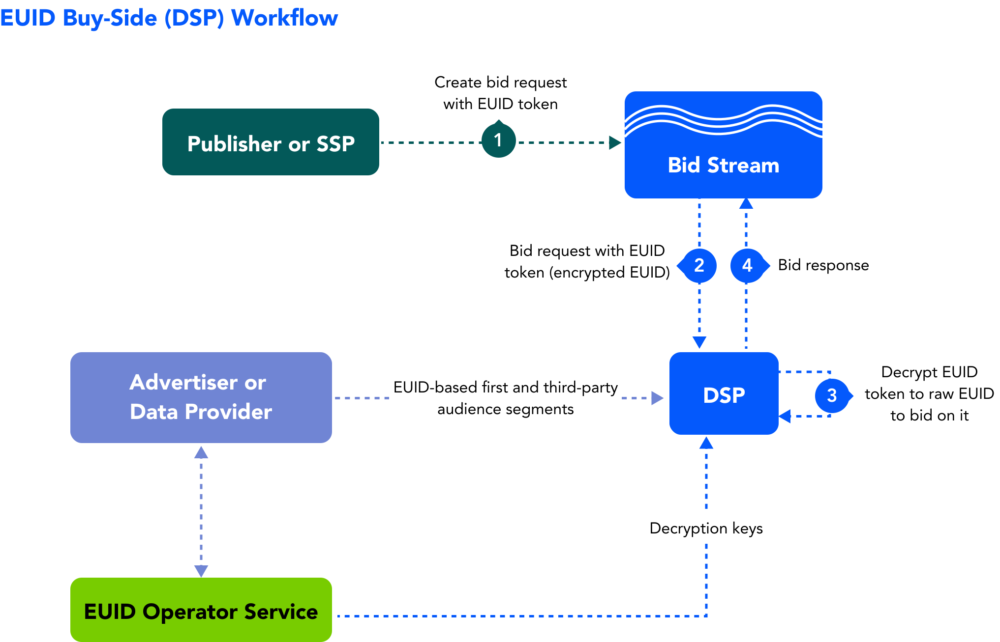

import Link from '@docusaurus/Link';

As a demand-side platform (DSP, media-buying platform), you can facilitate identity strategies that leverage European Unified ID (EUID) to facilitate the following:

- First-party data activation for advertisers
- Inventory monetization for publishers

Learn about benefits, workflow, documentation, and other resources for DSPs adopting EUID, as well as instructions for getting started.

## Benefits of EUID for DSPs

Here are just some of the intended benefits for DSPs using EUID. You can:
- Upgrade identity resolution with an authenticated ID.
- Reduce dependency on third-party cookies.
- Execute omnichannel and cross-device frequency management and suppression.
- Facilitate first-party data activation with a more privacy-conscious standard for ID encryption.
- Aim to develop future-proof models with deterministic data.
- Maintain addressable audience targeting.
- Offer opt-out, with the goal of improving consumer privacy controls.
- More accurately measure campaigns with or without third-party cookies.

## Workflow for DSPs

The following steps provide a high-level outline of the workflow intended for DSPs that transact on EUIDs in the <Link href="../ref-info/glossary-uid#gl-bidstream">bidstream</Link>.

The following processes occur in the background:
- The advertiser and/or data provider passes first-party and third-party audience segments to the DSP.
- The DSP syncs with the EUID Operator to receive decryption keys.
- The DSP listens to opt-out requests from the EUID Operator.

The following steps occur for each bid/ad impression:

1. A bid request is passed into the bidstream with the EUID token.
2. The DSP receives the bid request with the EUID token from the bidstream.
3. The DSP:
   - Decrypts the EUID token into a raw EUID.
   - Checks to see if the user opted out and, if so, does not bid.
   - Matches the raw EUID to an audience segment. 
4. The DSP sends a bid response to the bidstream with the EUID token.

## Getting Started

To get started, follow these steps:

1. Request access to EUID by filling out the form on the [Request Access](/request-access) page.
2. Implement a webhook to receive EUID opt-out information, and share the webhook with the EUID administrator.
3. Confirm that you are receiving the opt-out feed via the webhook.

    When the webhook is in place, you'll receive your credentials (see [EUID Credentials](../getting-started/gs-credentials.md)).
4. Decide which implementation option you want to use.
5. If you're using an SDK, download the SDK. Refer to the applicable SDK guide.
6. Follow the instructions in the implementation guide for the option you chose.

   :::note
   Be sure to encrypt request messages to EUID. For details, see [Encrypting Requests and Decrypting Responses](../getting-started/gs-encryption-decryption.md).
   :::
7. (Conditional) If you want to implement a CRM onboarding solution, request a separate set of credentials for the data provider workflow. See [EUID Credentials](../getting-started/gs-credentials.md).
8. Test.
9. Go live.

## Implementation Resources

The following documentation resources are available for DSPs to implement EUID.

| Type| Documentation | Content Description |
| :--- | :--- | :--- |
|SDK for Java | [SDK for Java Reference Guide](../sdks/sdk-ref-java.md) | An SDK for anyone using Java server-side and who wants to decrypt EUID advertising tokens to access the raw EUID.|
|SDK for Python | [SDK for Python Reference Guide](../sdks/sdk-ref-python.md) | An SDK for anyone using Python server-side and who wants to decrypt EUID advertising tokens to access the raw EUID.|
|SDK for C# / .NET | [SDK for C# / .NET Reference Guide](../sdks/sdk-ref-csharp-dotnet.md) | An SDK for anyone using .NET server-side and who wants to decrypt EUID advertising tokens to access the raw EUID.|
|SDK for C++ | [SDK for C++ Reference Guide](../sdks/sdk-ref-cplusplus.md) | An SDK for anyone using C++ server-side and who wants to decrypt EUID advertising tokens to access the raw EUID.|
| Integration Guide | [DSP Integration Guide](../guides/dsp-guide.md) | This integration guide for DSPs covers handling EUIDs for bidding and honoring user opt-outs. |

<!-- ## Integration Requirements

To integrate with EUID to receive EUIDs from brands (as first-party data) and data providers (as third-party data) and leverage them to inform bidding on EUIDs in the bidstream, the buy-side participants must meet the following requirements:

- Accept data in the form of EUIDs
- Bid on data in the form of EUIDs
- Build a webhook for honoring opt-out requests
- Sync <a href="../ref-info/glossary-uid#gl-encryption-key">encryption keys</a> daily with the EUID Administrator

For details, see [DSP Integration Guide](../guides/dsp-guide.md).

Optionally, if DSPs want to generate EUIDs themselves from personal data, they can also follow the [Third-Party Data Provider Workflow](overview-data-providers.md#workflow-for-data-providers). -->

## FAQs for DSPs

For a list of frequently asked questions for DSPs using the EUID framework, see [FAQs for DSPs](../getting-started/gs-faqs.md#faqs-for-dsps).
