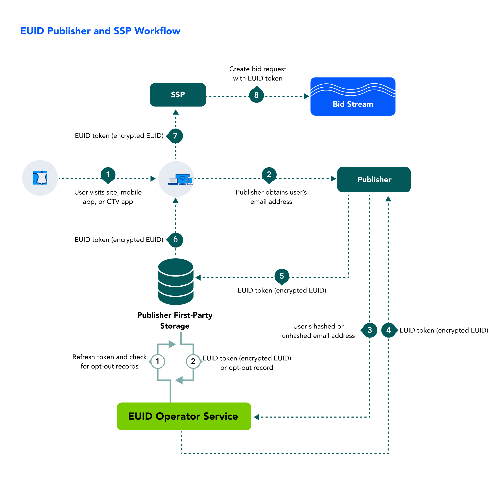

import Link from '@docusaurus/Link';
import IntegratingWithSSO from '../snippets/_integrating-with-sso.mdx';

As a publisher, you can benefit from the cross-device presence of European Unified ID (EUID) and take advantage of a consistent identity fabric on all your inventory.

Learn about benefits, workflow, documentation, and other resources for publishers adopting EUID, as well as instructions for getting started.

## Benefits of EUID for Publishers

Here are just some of the intended benefits for publishers integrating with EUID:
- Addressable audience targeting on desktop, mobile, and CTV with a single identifier.
- Frequency management across devices.
- More relevant content recommendations.
- The ability to provide personalized ad experiences with relevant content.
- The ability to offer opt-out, with the goal of improving consumer privacy controls.

## Workflow for Publishers

The following steps provide a high-level outline of the workflow intended for organizations that propagate EUID tokens to the <Link href="../ref-info/glossary-uid#gl-bidstream">bidstream</Link> via SSPs&#8212;for example, identity providers, publishers, and SSO providers. Publishers can choose to work with an SSO provider or an independent ID provider that is interoperable with EUID and can handle the EUID integration on behalf of publishers.

1. A user visits a publisher website, mobile app, or CTV app.

1. The publisher provides transparency around its data practices and asks the user to provide an email address or phone number, by login, [SSO login](#integrating-with-single-sign-on-sso), or other means, and consent to the use of their email address or phone number for EUID.
<!-- uid2_only_ep_20240312: The publisher provides transparency around its data practices and asks the user to provide an email address or phone number, by login or other means. -->
<!-- euid_only_ep_20240312: The publisher provides transparency around its data practices and asks the user to provide email address or phone number, by login or other means, and consent to the use of their email address or phone number for EUID. -->

1. Once the user has provided an email address or phone number, and consented, the publisher sends it to the EUID Operator via an SDK or direct API integration.
<!-- uid2_only_ep_20240312: Once the user has provided an email address or phone number, the publisher sends it to the UID2 Operator via an SDK or direct API integration. -->
<!-- euid_only_ep_20240312: Once the user has provided an email address or phone number, and consented, the publisher sends it to the EUID Operator via an SDK or direct API integration. -->

    :::tip
    A publisher can authorize an SSO provider or identity provider to pass <Link href="../ref-info/glossary-uid#gl-personal-data">personal data</Link> on their behalf.
    :::

1. The EUID Operator:
   - Takes the email or phone number.
   - Performs the salt, hash, and encryption process.
   - Returns the EUID token.

1. The publisher stores the EUID token to share with SSPs during real-time bidding.
   - Server-side: The publisher stores the token in a mapping table, DMP, data lake, or other server-side application.
   - Client-side: The publisher stores the token in a client-side app or in the user’s browser as a first-party cookie.

1. The publisher retrieves the EUID token from storage.

1. The publisher sends the EUID token to the SSP.

1. The SSP puts the bid request, with the EUID token, into the bidstream.

<!-- The publisher requests updated EUID tokens using a refresh token. When applicable, the refresh token includes a user’s opt-out request. -->

## Integrating with Single Sign-On (SSO)

<IntegratingWithSSO />

## Getting Started

To get started, follow these steps:

1. Request access to EUID by filling out the form on the [Request Access](/request-access) page.
1. Identify the properties that you want to integrate with EUID.
1. Sign the EUID contract.
1. Determine whether you want a <Link href="../ref-info/glossary-uid#gl-client-side">client-side</Link>, <Link href="../ref-info/glossary-uid#gl-client-server">client-server</Link>, or <Link href="../ref-info/glossary-uid#gl-server-side">server-side</Link> integration, and tell your EUID contact.

   For more information about these options, see [Integration Approaches](../ref-info/ref-integration-approaches.md).

1. Receive the [EUID credentials](../getting-started/gs-credentials.md).
1. Build your integration to EUID via an SDK or direct integration with the EUID APIs, using the applicable [implementation resources](#implementation-resources).

   :::note
   Be sure to encrypt request messages to EUID. For details, see [Encrypting Requests and Decrypting Responses](../getting-started/gs-encryption-decryption.md).
   :::

1. Test: 

    - Confirm that EUID tokens are being generated and passed correctly within the bid request.
    - Troubleshoot as needed, and work with SSPs to properly pass EUID tokens in bid requests.
1. Go live.

## Implementation Resources

The following resources are available for publishers to implement EUID:

- [Web Integrations](#web-integrations)
- [Mobile Integrations](#mobile-integrations)
- [CTV Integrations](#ctv-integrations)
- [Prebid Integrations](#prebid-integrations)
- [Google Ad Manager Integrations](#google-ad-manager-integrations)

### Web Integrations

The following resources are available for publisher web integrations.

:::tip
For a detailed summary of web integration options, see [Web Integration Overview](../guides/integration-options-publisher-web.md).
:::

| Integration Type| Documentation | Content Description |
| :--- | :--- | :--- |
| Prebid (Overview) | [EUID Integration Overview for Prebid](../guides/integration-prebid.md) | An overview of options for publishers who want to integrate with EUID and generate <Link href="../ref-info/glossary-uid#gl-euid-token">EUID tokens</Link> (advertising tokens) to be passed by Prebid.js or the Prebid Mobile SDK in the RTB bidstream. |
| Prebid.js Client-Side Integration | [EUID Client-Side Integration Guide for Prebid.js](../guides/integration-prebid-client-side.md) | A guide for publishers who want to request EUID tokens client-side, which is the easiest implementation approach, and choose to have Prebid.js manage the following: <ul><li>Token generation and <a href="../ref-info/glossary-uid#gl-token-refresh">token refresh</a>.</li><li>Passing the tokens into the RTB bidstream.</li></ul> |
| Prebid.js Client-Server Integration | [EUID Client-Server Integration Guide for Prebid.js](../guides/integration-prebid-client-server.md) | A guide for publishers who want to integrate with EUID and generate EUID tokens to be passed by Prebid.js in the RTB bidstream, but want to generate tokens server-side: for example, publishers who are using a <Link href="../ref-info/glossary-uid#gl-private-operator">Private Operator</Link>. |
| JavaScript (Overview) | [EUID Integration Overview for JavaScript](../guides/integration-javascript.md) | An overview of options for publishers who want to integrate with EUID using the JavaScript SDK. |
| JavaScript Client-Side Integration | [Client-Side Integration Guide for JavaScript](../guides/integration-javascript-client-side.md) | A guide for publishers who want to integrate with EUID using only client-side JavaScript changes, which is the easiest implementation approach. The SDK for JavaScript manages token generation and token refresh automatically. |
| JavaScript Client-Server Integration | [Client-Server Integration Guide for JavaScript](../guides/integration-javascript-client-server.md) | A publisher guide covering standard web integration scenarios that use the SDK for JavaScript and require tokens to be generated on the server side and passed to the publisher web pages. |
| Server-Side Integration | [Publisher Integration Guide, Server-Side](../guides/integration-publisher-server-side.md) | A guide for publishers who do not use the [SDK for JavaScript](../sdks/sdk-ref-javascript.md). |
| Publisher/SSP Integration with GAM | [Google Ad Manager Secure Signals Integration Guide](../guides/integration-google-ss.md) | A guide covering the additional steps needed for publishers using EUID with the Google Ad Manager Secure Signals feature (previously known as Encrypted Signals for Publishers, ESP). |

### Mobile Integrations

The following resources are available for publisher integrations supporting Android or iOS devices.

| Integration Type| Documentation | Content Description |
| :--- | :--- | :--- |
| Android/iOS (Overview) | [Mobile Integration Overview for Android and iOS](../guides/integration-mobile-overview.md) | An overview of options for mobile app publishers who want to integrate with EUID using the SDK for Android or the SDK for iOS. |
| Android/iOS, Client-Side Integration | [Client-Side Integration Guide for Mobile](../guides/integration-mobile-client-side.md) | An integration guide for mobile app publishers who want to integrate with EUID with changes only within the mobile app (no server-side changes). |
| Android/iOS, Client-Server Integration | [Client-Server Integration Guide for Mobile](../guides/integration-mobile-client-server.md) | An integration guide for mobile app publishers who want to integrate with EUID by doing the following:<ol><li>Generating EUID tokens server-side via either a Public or Private Operator.</li><li>Passing the resulting <Link href="../ref-info/glossary-uid#gl-identity">identities</Link> to a mobile app for passing into the bidstream.</li></ol> |
| Android | [SDK for Android Reference Guide](../sdks/sdk-ref-android.md) |An SDK that facilitates the process of generating or establishing client identity using EUID and retrieving EUID tokens for publishers that need to support Android apps. |
| iOS | [SDK for iOS Reference Guide](../sdks/sdk-ref-ios.md) | An SDK that facilitates the process of generating or establishing client identity using EUID and retrieving EUID tokens for publishers that need to support iOS apps. |

### CTV Integrations

The following resources are available for publisher integrations supporting CTV.

| Integration Type| Documentation | Content Description |
| :--- | :--- | :--- |
| CTV | [CTV Integration Guide](../guides/integration-ctv-guide.md) | A summary of CTV integration options, with links to additional information and instructions. |

### Prebid Integrations

The following resources are available for publishers integrating with Prebid.

| Integration Type| Documentation | Content Description |
| :--- | :--- | :--- |
| Prebid (Overview) | [EUID Integration Overview for Prebid](../guides/integration-prebid.md) | An overview of options for publishers who want to integrate with EUID and generate <Link href="../ref-info/glossary-uid#gl-euid-token">EUID tokens</Link> (advertising tokens) to be passed by Prebid.js or the Prebid Mobile SDK in the RTB bidstream. |
| Prebid.js Client-Side Integration | [EUID Client-Side Integration Guide for Prebid.js](../guides/integration-prebid-client-side.md) | A guide for publishers who want to request EUID tokens client-side, which is the easiest implementation approach, and choose to have Prebid.js manage the following: <ul><li>Token generation and <a href="../ref-info/glossary-uid#gl-token-refresh">token refresh</a>.</li><li>Passing the tokens into the RTB bidstream.</li></ul> |
| Prebid.js Client-Server Integration | [EUID Client-Server Integration Guide for Prebid.js](../guides/integration-prebid-client-server.md) | A guide for publishers who want to integrate with EUID and generate EUID tokens to be passed by Prebid.js in the RTB bidstream, but want to generate tokens server-side: for example, publishers who are using a Private Operator. |
| Prebid.js on Mobile | [EUID Mobile Integration for Prebid.js](../guides/integration-prebid-mobile-summary.md) | A summary of information resources for EUID integration with Prebid.js on mobile devices. |

### Google Ad Manager Integrations

The following resources are available for publishers integrating with Google Ad Manager.

| Integration Type| Documentation | Content Description |
| :--- | :--- | :--- |
| Publisher/SSP Integration with GAM | [Google Ad Manager Secure Signals Integration Guide](../guides/integration-google-ss.md) | A guide covering the additional steps needed for publishers using EUID with the Google Ad Manager Secure Signals feature (previously known as Encrypted Signals for Publishers, ESP). |
| GMA for Android | [EUID GMA Plugin for Android Integration Guide](../guides/mobile-plugin-gma-android.md) | A guide that enables publishers using the Google Mobile Ads (GMA) SDK to include EUID tokens in ad requests from their Android apps. |
| GMA for iOS | [EUID GMA Plugin for iOS Integration Guide](../guides/mobile-plugin-gma-ios.md) | A guide that enables publishers using the Google Mobile Ads (GMA) SDK to include EUID tokens in ad requests from their iOS apps. |
| IMA for Android | [EUID IMA Plugin for Android Integration Guide](../guides/mobile-plugin-ima-android.md) | A guide that enables publishers using the Google Interactive Media Ads (IMA) SDK to include EUID tokens in ad requests from their Android apps. |
| IMA for iOS | [EUID IMA Plugin for iOS Integration Guide](../guides/mobile-plugin-ima-ios.md) | A guide that enables publishers using the Google Interactive Media Ads (IMA) SDK to include EUID tokens in ad requests from their iOS apps. |

## FAQs for Publishers

For a list of frequently asked questions for publishers using the EUID framework, see [FAQs for Publishers](/docs/getting-started/gs-faqs.md#faqs-for-publishers).
