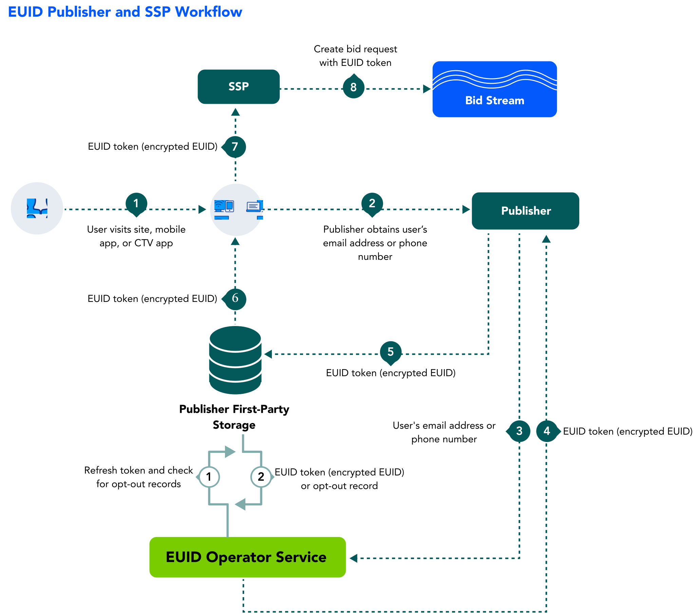

import Link from '@docusaurus/Link';
import IntegratingWithSSO from '../snippets/_integrating-with-sso.mdx';
import PrivateOperatorOption from '../snippets/_private-operator-option.mdx';
import PublisherImplementationResources from '../snippets/_publisher-implementation-resources.mdx';

As a publisher, you can benefit from the cross-device presence of European Unified ID (EUID) and take advantage of a consistent identity fabric on all your inventory.

Learn about benefits, workflow, documentation, and other resources for publishers adopting EUID, as well as instructions for getting started.

## Benefits of EUID for Publishers

Here are just some of the intended benefits for publishers integrating with EUID:
- Addressable audience targeting on desktop, mobile, and CTV with a single identifier.
- Frequency management across devices.
- More relevant content recommendations.
- The ability to provide personalized ad experiences with relevant content.
- The ability to offer opt-out, with the goal of improving consumer privacy controls.

## Workflow for Publishers

The following steps provide a high-level outline of the workflow intended for organizations that propagate EUID tokens to the <Link href="../ref-info/glossary-uid#gl-bidstream">bidstream</Link> via SSPs&#8212;for example, identity providers, publishers, and SSO providers. Publishers can choose to work with an SSO provider or an independent ID provider that is interoperable with EUID and can handle the EUID integration on behalf of publishers.

1. A user visits a publisher website, mobile app, or CTV app.

1. The publisher provides transparency around its data practices and asks the user to provide an email address or phone number, by login, [SSO login](#integrating-with-single-sign-on-sso), or other means, and consent to the use of their email address or phone number for EUID.
<!-- uid2_only_ep_20240312: The publisher provides transparency around its data practices and asks the user to provide an email address or phone number, by login or other means. -->
<!-- euid_only_ep_20240312: The publisher provides transparency around its data practices and asks the user to provide email address or phone number, by login or other means, and consent to the use of their email address or phone number for EUID. -->

1. Once the user has provided an email address or phone number, and consented, the publisher sends it to the EUID Operator via an SDK or direct API integration.
<!-- uid2_only_ep_20240312: Once the user has provided an email address or phone number, the publisher sends it to the UID2 Operator via an SDK or direct API integration. -->
<!-- euid_only_ep_20240312: Once the user has provided an email address or phone number, and consented, the publisher sends it to the EUID Operator via an SDK or direct API integration. -->

    :::tip
    A publisher can authorize an SSO provider or identity provider to pass <Link href="../ref-info/glossary-uid#gl-personal-data">personal data</Link> on their behalf.
    :::

1. The EUID Operator:
   - Takes the email or phone number.
   - Performs the salt, hash, and encryption process.
   - Returns the EUID token.

1. The publisher stores the EUID token to share with SSPs during real-time bidding.
   - Server-side: The publisher stores the token in a mapping table, DMP, data lake, or other server-side application.
   - Client-side: The publisher stores the token in a client-side app or in the user’s browser as a first-party cookie.

1. The publisher retrieves the EUID token from storage.

1. The publisher sends the EUID token to the SSP.

1. The SSP puts the bid request, with the EUID token, into the bidstream.

<!-- The publisher requests updated EUID tokens using a refresh token. When applicable, the refresh token includes a user’s opt-out request. -->

## Integrating with Single Sign-On (SSO)

<IntegratingWithSSO />

## Private Operator Option

<PrivateOperatorOption/>

## Getting Started

To get started, follow these steps:

1. Request access to EUID by filling out the form on the [Request Access](/request-access) page.
1. Identify the properties that you want to integrate with EUID.
1. Sign the EUID contract.
1. Determine whether you want a <Link href="../ref-info/glossary-uid#gl-client-side">client-side</Link>, <Link href="../ref-info/glossary-uid#gl-client-server">client-server</Link>, or <Link href="../ref-info/glossary-uid#gl-server-side">server-side</Link> integration, and tell your EUID contact.

   For more information about these options, see [Integration Approaches](../ref-info/ref-integration-approaches.md).

1. Receive the [EUID credentials](../getting-started/gs-credentials.md).
1. Build your integration to EUID via an SDK or direct integration with the EUID APIs, using the applicable [implementation resources](#implementation-resources).

   :::note
   Be sure to encrypt request messages to EUID. For details, see [Encrypting Requests and Decrypting Responses](../getting-started/gs-encryption-decryption.md).
   :::

1. Test: 

    - Confirm that EUID tokens are being generated and passed correctly within the bid request.
    - Troubleshoot as needed, and work with SSPs to properly pass EUID tokens in bid requests.
1. Go live.

## Implementation Resources

<PublisherImplementationResources/>

## FAQs for Publishers

For a list of frequently asked questions for publishers using the EUID framework, see [FAQs for Publishers](/docs/getting-started/gs-faqs.md#faqs-for-publishers).
